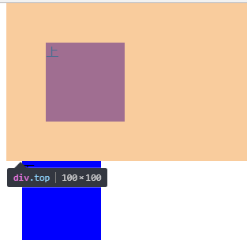
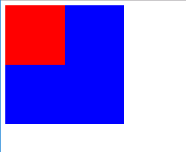
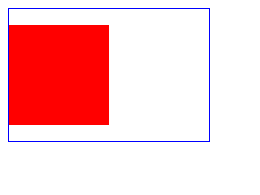

# 业务中训练的 CSS 奇技淫巧
> CSS1
* [一、水平居中](一、水平居中)
* [二、垂直居中](二、垂直居中)
* [三、水平垂直居中](三、水平垂直居中)
* [四、清除浮动](四、清除浮动)
* [五、文本溢出加省略号](五、文本溢出加省略号)
* [六、CSS层级](六、CSS层级)
* [七、透明度详解](七、透明度详解)
* [八、display:table-cell的妙用](八、display:table-cell的妙用)
* [九、vertical-align的原理](十、vertical-align的原理)
* [十、CSS实现滚动](九、CSS实现滚动)
* [十一、Android浏览器文本垂直居中问题](十一、Android浏览器文本垂直居中问题)


## 一、水平居中
> 行内元素display：inline，块级元素display：block

### 1、行内元素解决方案
只需要把行内元素包裹在一个属性display为block的父层元素中，并且把父层元素添加如下属性即可：
```
.parent {
  display: block;
  text-align: center;
}
```

### 2、块状元素解决方案
```
.child {
  /* 这里可以设置顶端外边距 */
  margin: 10px auto;
}
```

### 3、多个块状元素解决方案
将元素的display属性设置为inline-block，并且把父元素的text-align属性设置为center即可:
```
.parent {
  text-align: center;
}
.child {
  display: inline-block;
}
```

### 4、多个块状元素解决方案 (使用flexbox布局实现)
使用flexbox布局，只需要把待处理的块状元素的父元素添加属性display:flex及justify-content:center即可:
```
.parent {
  display:flex;
  justify-content:center;
}
```

顺便介绍一下flex布局的justify-content属性

justify-content属性定义了项目在主轴上的对齐方式。
* flex-start（默认值）：左对齐
* flex-end：右对齐
* center： 居中
* space-between：两端对齐，项目之间的间隔都相等。
* space-around：每个项目两侧的间隔相等。所以，项目之间的间隔比项目与边框的间隔大一倍。

## 二、垂直居中
### 1、单行的行内元素解决方案
```
.parent {
  height: 200px;
}
 
/* 以下代码中，将a元素的height和line-height设置的和父元素一样高度即可实现垂直居中 */
a {
  height: 200px;
  line-height:200px; 
}
```

### 2、多行的行内元素解决方案
组合使用display:table-cell和vertical-align:middle属性来定义需要居中的元素的父容器元素生成效果，如下：
```
.parent {
  height: 300px;
  /* 以下属性垂直居中 */
  display: table-cell;
  vertical-align:middle;
}
```

### 3、若父容器下只有一个元素，且父元素设置了高度
```
.parent {
  height:xxx;
}
.child {
  position: relative;
  top: 50%;
  transform: translateY(-50%);
}
```

### 4、不知道自己高度和父容器高度的情况下, 利用绝对定位只需要以下三行：
```
.parent {
  position:relative;
}

.child {
   position: absolute;
   top: 50%;
   transform: translateY(-50%);
}
 ```

### 5、利用 flex 布局实现
```
.parent{
    display: flex;
    align-items: center;
    /* 注意这里需要设置高度来查看垂直居中效果 */
    height: 300px;
}
```

## 三、水平垂直居中
### 1、已知高度和宽度的元素解决方案1
这是一种不常见的居中方法，可自适应，比方案2更智能，如下：
```
.item{
    position: absolute;
    margin:auto;
    left:0;
    top:0;
    right:0;
    bottom:0;
}

```

### 2、已知高度和宽度的元素解决方案2
```
.item{
    position: absolute;
    top: 50%;
    left: 50%;
    margin-top: -75px;  /* 设置margin-left / margin-top 为自身高度的一半 */
    margin-left: -75px;
}
```

### 3、未知高度和宽度元素解决方案
```
.item{
    position: absolute;
    top: 50%;
    left: 50%;
    transform: translate(-50%, -50%);  /* 使用css3的transform来实现 */
}
```

### 4、使用flex布局实现
```
.parent{
    display: flex;
    justify-content:center;
    align-items: center;
    /* 注意这里需要设置高度来查看垂直居中效果 */
    background: #AAA;
    height: 300px;
}
```

---
Vxx中实现背景图效果：
```
.product-item-inner::after {
    content: "";
    width: 100%;
    height: 100%;
    position: absolute;
    left: 50%;
    top: 100%; 
    background: url(//h2.vipstatic.com/mst.vipstatic.com/demo/image/last-new.png) 0 0 no-repeat #E6E7E6;
    background-size: cover;
    transform: translateX(-50%);
    margin-top: 0.03rem;
    box-sizing: border-box;
  }
```
待确认思路：为了实现若是没有列表的时候坑位仍然有背景图，上一个坑位的after覆盖下一个坑位背景，但是利用那个垂直居中的代码实现，发现会覆盖住本身坑位。所以是不是渲染问题，所以坑位after元素先渲染，下一个坑位才开始渲染，元素就会覆盖背景图？

## 四、清除浮动

### 1、普通流定位 static（默认方式） 
普通流定位，又称为文档流定位，是页面元素的默认定位方式      
页面中的块级元素：按照从上到下的方式逐个排列   
页面中的行内元素：按照从左到右的方式逐个排列     
但是如何让多个块级元素在一行内显示?    
这里就引出了浮动定位     

### 2、浮动定位 float 
float属性 取值为 left/right    
这个属性原本不是用来布局的，而是用来做文字环绕的，但是后来人们发现做布局也不错，就一直这么用了，甚至有些时候都忘了用他做文字环绕 

### 3、相对定位 relative 
元素会相对于它原来的位置偏移某个距离，改变元素位置后，原本的元素**占据空间**

### 4、绝对定位 absolute 
如果元素被设置为绝对定位的话，将具备以下几个特征   
1、**脱离文档流**-不占据页面空间   
2、通过偏移属性固定元素位置   
3、生成绝对定位的元素，相对于**除了 static 定位**以外的第一个父元素进行定位。   
4、如果没有已定位祖先元素，那么就相对于最初的包含块(body,html)去实现位置的固定  

### 5、固定定位 fixed 
将元素固定在页面的某个位置处，不会随着滚动条而发生位置移动   

### 清除浮动方案一
直接设置父元素的高度   
优势：极其简单   
弊端：必须要知道父元素高度是多少  

### 清除浮动方案二
在父元素中，追加空子元素，并设置其clear属性为both   
clear是css中专用于清除浮动的属性   
作用：清除当前元素前面的元素浮动所带来的影响   
取值：   
1、none   
默认值，不做任何清除浮动的操作   
2、left   
清除前面元素左浮动带来的影响   
3、right    
清除前面元素右浮动带来的影响   
4、both   
清除前面元素所有浮动带来的影响   
优势：代码量少 容易掌握 简单易懂   
弊端：会添加许多无意义的空标签，有违结构与表现的分离，不便于后期的维护  


### 清除浮动方案三
设置父元素浮动    
优势：简单，代码量少，没有结构和语义化问题   
弊端：对后续元素会有影响  

### 清除浮动方案四
为父元素设置overflow属性   
取值：hidden 或 auto   
优势：简单，代码量少   
弊端：如果有内容要溢出显示(弹出菜单)，也会被一同隐藏  

### 清除浮动方案五
父元素设置display:table   
优势：不影响结构与表现的分离，语义化正确，代码量少   
弊端：盒模型属性已经改变，会造成其他问题  

### 清除浮动方案六
使用内容生成的方式清除浮动
```
.clearfix:after {
   content:""; 
   display: block; 
   clear:both; 
}
```
:after 选择器向选定的元素之后插入内容   
content:""; 生成内容为空    
display: block; 生成的元素以块级元素显示,   
clear:both; 清除前面元素浮动带来的影响   
相对于空标签闭合浮动的方法    
优势：不破坏文档结构，没有副作用   
弊端：代码量多  

### 清除浮动方案七
```
.cf:before,.cf:after {
   content:"";
   display:table;
}
.cf:after { clear:both; }
```
优势：不破坏文档结构，没有副作用    
弊端： 代码量多    
注意：display:table本身无法触发BFC，但是它会产生匿名框(anonymous boxes)，而匿名框中的display:table-cell可以触发BFC，简单说就是，触发块级格式化上下文的是匿名框，而不是display:table。所以通过display:table和display:table-cell创建的BFC效果是不一样的（后面会说到BFC）。

### 疑问
为什么会margin边距重叠？    
overflow:hidden, 语义应该是溢出:隐藏，按道理说，子元素浮动了，但依然是在父元素里的，而父元素高度塌陷，高度为0了，子元素应该算是溢出了，为什么没有隐藏，反而撑开了父元素的高度？     
为什么display:table也能清除浮动，原理是什么？   

### 解释
要解释这些疑问，我们就要提到Formatting context 
Formatting context是W3C CSS2.1规范中的一个概念。它是页面中的一块渲染区域，并且有一套渲染规则，它决定了其子元素将如何定位，以及和其他元素的关系和相互作用。 
最常见的Formatting context有Block fomatting context(简称BFC)和Inline formatting context(简称IFC)。 
CSS2.1 中只有BFC和IFC, CSS3中还增加了GFC和FFC 

### BFC 
BFC(Block formatting context)直译为”块级格式化上下文”。它是一个独立的渲染区域，只有Block-level box参与， 它规定了内部的Block-level Box如何布局，并且与这个区域外部毫不相干。

block-level box，display属性为block, list-item, table的元素，会生成block-level box。并且参与block fomatting context。 
inline-level box， display属性为inline, inline-block, inline-table的元素，会生成inline-level box。并且参与inline formatting context。

### BFC布局规则： 
* 内部的Box会在垂直方向，按照从上到下的方式逐个排列。 
* Box垂直方向的距离由margin决定。属于同一个BFC的两个相邻Box的margin会发生重叠 
* 每个元素的margin box的左边， 与包含块border box的左边相接触(对于从左往右的格式化，否则相反)。即使存在浮动也是如此。 
* BFC的区域不会与float box重叠。 
* BFC就是页面上的一个隔离的独立容器，容器里面的子元素不会影响到外面的元素。反之也如此。 
* 计算BFC的高度时，浮动元素的高度也参与计算 

### 触发BFC的条件 
1、根元素 
2、float 取值 none 以外的值    
3、overflow 除了visible 以外的值（hidden，auto，scroll ）    
4、display (table-cell，table-caption，inline-block，flex，inline-flex)    
5、position（absolute，fixed）    
```
<!--Box垂直方向的距离由margin决定。属于同一个BFC的两个相邻Box的margin会发生重叠 
注意：发生重叠后，外边距的高度等于两个发生重叠的外边距的高度中的较大者-->
<style>
   .top{
    width:100px;
    height:100px;
    background:red;
    margin:50px;
   }
   .bottom{
    width:100px;
    height:100px;
    background:blue;
    margin:20px;
   }
</style>
<body>
    <div class="top">上</div>
    <div class="bottom">下</div>
</body>
```

```
<!--每个元素的margin box的左边， 与包含块border box的左边相接触(对于从左往右的格式化，否则相反)。即使存在浮动也是如此。 
我们可以看到，虽然有浮动的元素top，但是bottom的左边依然与包含块的左边相接触。-->
<style>
   .top{
    width:100px;
    height:100px;
    background:red;
    float:left;
   }
   .bottom{
    width:200px;
    height:200px;
    background:blue;
   }
</style>
<body>
    <div class="top"></div>
    <div class="bottom"></div>
</body>
```

```
<!--BFC的区域不会与float box重叠。 
看代码和效果图，可以看出，这次的代码比上面的代码多了一行overflow:hidden;用这行代码触发新的BFC后，由于这个新的BFC不会与浮动的top重叠，所以bottom的位置改变了-->
<style>
   .top{
    width:100px;
    height:100px;
    background:red;
    float:left;
   }
   .bottom{
    width:200px;
    height:200px;
    background:blue;
    overflow:hidden;
   }
</style>
<body>
    <div class="top"></div>
    <div class="bottom"></div>
</body>
```

```
<!--计算BFC的高度时，浮动元素的高度也参与计算。 
到此我们应该是解决了上面的所有疑问了。-->
<style>
   p{
    width:100px;
    height:100px;
    background:red;
    float:left;
   }
   div{
    width:200px;
    border:1px solid blue;
    overflow: hidden;
   }
</style>
<body>
    <div>
       <p></p>
    </div>
</body>
```


---
VXX清除浮动方式
```
.clearfix:after {
  visibility: hidden;
  display: block;
  font-size: 0;
  content: " ";
  clear: both;
  height: 0;
}
```

## 五、文本溢出加省略号
### 1、单行文本溢出增加省略号
```
width:300px;    
overflow: hidden;    
text-overflow:ellipsis;    
white-space: nowrap;
```
### 2、多行文本溢出增加省略号
```
display: -webkit-box;    
-webkit-box-orient: vertical;    
-webkit-line-clamp: 3;    
overflow: hidden;
text-overflow:ellipsis;
```
---
场景：需要当字体只占一行时候下面的元素往上顶，两行的时候换行显示两行并有省略号
```
height: auto;
max-height: 0.46rem; /* 两行时候的高度 */
display: -webkit-box;  
-webkit-box-orient: vertical;
-webkit-line-clamp: 2;
white-space: normal; 
line-height: 0.23rem;
font-weight: bold;
font-size: 0.16rem;
word-break: break-all;
```


## 六、CSS层级
### 1、层叠上下文
> 如果一个元素含有层叠上下文，我们可以理解为这个元素在z轴上就“高人一等”。

### 2、层叠水平
> 决定了同一个层叠上下文中元素在z轴上的显示顺序。普通元素的层叠水平优先由层叠上下文决定，因此，层叠水平的比较只有在当前层叠上下文元素中才有意义。需要注意的是，诸位千万不要把层叠水平和CSS的z-index属性混为一谈。没错，某些情况下z-index确实可以影响层叠水平，但是，只限于定位元素以及flex盒子的孩子元素；而层叠水平所有的元素都存在。

层叠上下文元素有如下特性：

* 层叠上下文的层叠水平要比普通元素高（原因后面会说明）；
* 层叠上下文可以阻断元素的混合模式（见此文第二部分说明）；
* 层叠上下文可以嵌套，内部层叠上下文及其所有子元素均受制于外部的层叠上下文。
* 每个层叠上下文和兄弟元素独立，也就是当进行层叠变化或渲染的时候，只需要考虑后代元素。
* 每个层叠上下文是自成体系的，当元素发生层叠的时候，整个元素被认为是在父层叠上下文的层叠顺序中。

### 3、层叠顺序准则

* 谁大谁上：当具有明显的层叠水平标示的时候，如识别的z-indx值，在同一个层叠上下文领域，层叠水平值大的那一个覆盖小的那一个。
* 后来居上：当元素的层叠水平一致、层叠顺序相同的时候，在DOM流中处于后面的元素会覆盖前面的元素。

[深入理解CSS中的层叠上下文和层叠顺序](https://www.zhangxinxu.com/wordpress/2016/01/understand-css-stacking-context-order-z-index/)


## 七、透明度详解
* css3的opacity:x，x 的取值从 0 到 1，如opacity: 0.8
* css3的rgba(red, green, blue, alpha)，alpha的取值从 0 到 1，如rgba(255,255,255,0.8)

使用说明
* 设置opacity元素的所有后代元素会随着一起具有透明性，一般用于调整图片或者模块的整体不透明度。那么使用opacity实现《背景透明，文字不透明》是不可取的。


* 背景透明，文字不透明
```
background-color:#000000;/* IE6和部分IE7内核的浏览器(如QQ浏览器)下颜色被覆盖 */
background-color:rgba(0,0,0,0.2); /* IE6和部分IE7内核的浏览器(如QQ浏览器)会读懂，但解析为透明 */
```

## 八、display:table-cell的妙用
### 1、大小不固定的图片和多行文字的垂直水平居中
```
<div class="table">
  
</div>

.table {
    width: 200px;
    height: 200px;
    border: 1px solid red;
    display: table-cell;
    text-align: center;
    vertical-align: middle;
} 
.table img {
  vertical-align:middle;
}
```

### 2、实现两栏自适应布局
```
<div class="main">
  </img>
  <div class="text">
   <p>aaaaaa</p>
   <p>bbbbbbbb</p>
   <p>啦啦啦啦啦啦啦啦啦啦啦啦啦啦啦啦啦啦啦啦啦啦啦啦啦啦啦啦啦啦啦啦啦</p>
  </div>
</div>
```
```
.main {
  display: table;
}
img {
  float: left;
}
.text {
  display: table-cell;
}
.main:after,.main:before {
  display: table;
  content: "";
  clear: both;
}
```

### 3、实现等高布局
```
<div class="wrap">
  <div class="main">
     <div>aaa</div>
     <div>bbb</div>
     <div>ccc</div>
  </div>
</div>

.main {
  display: table;
}
 
.main div {
  display: table-cell;
}
```

### 插播一个进度条
> 该进度条需要右边的字固定，左边的进度条自适应右边的字


```
.prepay-progress-box {
    width: 100%;
    height: 0.16rem;
    display:table;
    .sold-out {
      float: right;
      white-space: nowrap;
    }
    .progress-wrapper {
      width: 100%;
      display: table-cell;
      position: relative;
      .progress {
        width:100%;
        height: 0.06rem;
        position: absolute;
        top: 50%;
        transform: translateY(-50%);
        background-color: rgba(1,1,1,0.14);
        border-radius: 0.08rem;
        i {
          position: absolute;
          top:0;
          left: 0;
          height: 100%;
          background-color: $mst-c1;
          border-radius: 0.08rem;
        }
      }
    }
  }
```
这里没有添加去浮动，是因为自适应的元素设置了高度


## 九、vertical-align的原理

## 十、CSS实现滚动
-webkit-overflow-scrolling 属性控制元素在移动设备上是否使用滚动回弹效果.  
* auto: 使用普通滚动, 当手指从触摸屏上移开，滚动会立即停止。  
* touch: 使用具有回弹效果的滚动, 当手指从触摸屏上移开，内容会继续保持一段时间的滚动效果。继续滚动的速度和持续的时间和滚动手势的强烈程度成正比。同时也会创建一个新的堆栈上下文。
```
.box {
  width: 100%;
  overflow-x: scroll;
  -webkit-overflow-scrolling: touch;
  white-space: nowrap;
}
.item {
  display: inline-block;
}
```
```
html, body {
  height: 100%;
}
main {
  padding: 50px 0;
  height: 100%;
  overflow-y: scroll;
  -webkit-overflow-scrolling: touch;
}
```

## 十一、Android浏览器文本垂直居中问题
在开发中，我们常使用 line-height 属性来实现文本的垂直居中，但是在安卓浏览器渲染中有一个常见的问题，就是对于小于12px的字体使用 line-height 属性进行垂直居中的时候，渲染出来的效果并不是文字垂直居中，而是会偏上一些。

原因：字体大小小于 12px
### 解决方法一
```
<div class="container">
  <span class="content">testtesttesttesttest</span>
</div>

.container {
    display: table;
}
.content {
    background-color: gray;
    font-size: 10px;
    display: table-cell;
    vertical-align: middle;
}
```
