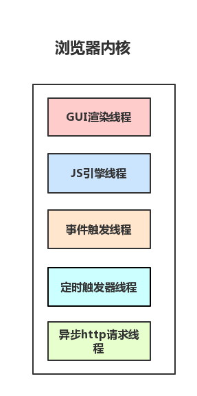
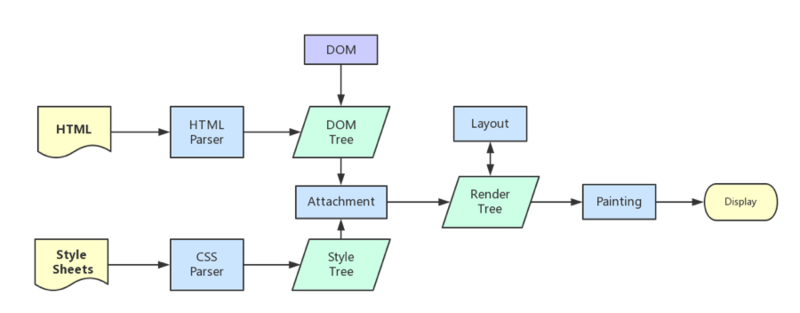

# 浏览器多进程与JS单线程
> kernel

* [区分进程和线程](#区分进程和线程)
* [浏览器是多进程的](#浏览器是多进程的)
  * [浏览器都包含哪些进程](#浏览器都包含哪些进程)
  * [浏览器多进程的优势](#浏览器多进程的优势)
  * [浏览器内核即Renderer进程](#浏览器内核即Renderer进程)
  * [Browser进程和Renderer进程的通信过程](#Browser进程和Renderer进程的通信过程)
* [浏览器内核中线程之间的关系](#浏览器内核中线程之间的关系)
  * [GUI渲染线程与JS引擎线程互斥](#GUI渲染线程与JS引擎线程互斥)
  * [JS阻塞页面加载](#JS阻塞页面加载)
  * [WebWorker](#WebWorker)
  * [WebWorker与SharedWorker](#WebWorker与SharedWorker)
* [浏览器渲染流程](#浏览器渲染流程)
  * [load事件与DOMContentLoaded事件的先后](#load事件与DOMContentLoaded事件的先后)
  * [css加载是否会阻塞dom树渲染](#css加载是否会阻塞dom树渲染)
  * [普通图层和复合图层](#普通图层和复合图层)
* [从Event Loop谈JS的运行机制](#从Event Loop谈JS的运行机制)
  * [事件循环机制](#事件循环机制)
  * [定时器](#定时器)
  * [setTimeout与setInterval](#setTimeout与setInterval)
* [macrotask与microtask](#macrotask与microtask)
## 区分进程和线程
* 进程是cpu资源分配的最小单位（是能拥有资源和独立运行的最小单位）
* 线程是cpu调度的最小单位（线程是建立在进程的基础上的一次程序运行单位，一个进程中可以有多个线程，共享同一个进程内的资源）

tips：
* 不同进程之间也可以通信，不过代价较大
* 现在，一般通用的叫法：单线程与多线程，都是指在一个进程内的单和多。（所以核心还是得属于一个进程才行）

## 浏览器是多进程的
> 浏览器是多线程的，但JS是单线程的

每一个Tab页面有一个独立的进程，以及一个主进程，浏览器应该也有自己的优化机制，有时候打开多个tab页后，可以在Chrome任务管理器中看到，有些进程被合并了
### 浏览器都包含哪些进程
> 列举主要进程

1. **Browser进程**：浏览器的主进程（负责协调、主控），只有一个。作用有
  * 负责浏览器界面显示，与用户交互。如前进，后退等
  * 负责浏览器界面显示，与用户交互。如前进，后退等
  * 将Renderer进程得到的内存中的Bitmap，绘制到用户界面上
  * 网络资源的管理，下载等
2. **第三方插件进程**：每种类型的插件对应一个进程，仅当使用该插件时才创建
3. **GPU进程**：最多一个，用于3D绘制等
4. **浏览器渲染进程（浏览器内核）（Renderer进程，内部是多线程的）**：默认每个Tab页面一个进程，互不影响。主要作用为
  * 页面渲染，脚本执行，事件处理等


### 浏览器多进程的优势
* 避免单个page crash影响整个浏览器
* 避免第三方插件crash影响整个浏览器
* 多进程充分利用多核优势
* 方便使用沙盒模型隔离插件等进程，提高浏览器稳定性

空间换时间

### 浏览器内核即Renderer进程
> 列举主要常驻线程

1. **GUI渲染线程**
  * 负责渲染浏览器界面，解析HTML，CSS，构建DOM树和RenderObject树，布局和绘制等。
  * 当界面需要重绘（Repaint）或由于某种操作引发回流(reflow)时，该线程就会执行
  * 注意，**GUI渲染线程与JS引擎线程是互斥的**，当JS引擎执行时GUI线程会被挂起（相当于被冻结了），GUI更新会被保存在一个队列中等到**JS引擎空闲时**立即被执行。

2. **JS引擎线程**
  * 也称为JS内核，负责处理Javascript脚本程序。（例如V8引擎）
  * JS引擎线程负责解析Javascript脚本，运行代码。
  * JS引擎一直**等待着任务队列中任务的到来**，然后加以处理，一个Tab页（renderer进程）中无论什么时候都只有一个JS线程在运行JS程序
  * 同样注意，**GUI渲染线程与JS引擎线程是互斥的**，所以如果JS执行的时间过长，这样就会造成页面的渲染不连贯，导致页面渲染加载阻塞。

3. **事件触发线程**
  * 归属于浏览器而不是JS引擎，用来控制事件循环（可以理解，JS引擎自己都忙不过来，需要浏览器另开线程协助）
  * 当JS引擎执行代码块如setTimeOut时（也可来自浏览器内核的其他线程,如鼠标点击、AJAX异步请求等），会将对应任务添加到事件线程中
  * 当对应的事件符合触发条件被触发时，该线程会把事件添加到待处理队列的队尾，等待JS引擎的处理
  * 注意，由于JS的单线程关系，所以这些待处理队列中的事件都当JS引擎空闲时才会去执行

4. **定时触发器线程**
  * 传说中的setInterval与setTimeout所在线程
  * 浏览器定时计数器并不是由JavaScript引擎计数的,（因为JavaScript引擎是单线程的, 如果处于阻塞线程状态就会影响记计时的准确）
  * 因此通过单独线程来计时并触发定时（计时完毕后，添加到事件队列中，等待JS引擎空闲后执行）
  * 注意，W3C在HTML标准中规定，规定要求setTimeout中低于4ms的时间间隔算为4ms。

5. **异步http请求线程**
  * 在XMLHttpRequest在连接后是通过浏览器新开一个线程请求
  * 将检测到状态变更时，如果设置有回调函数，异步线程就产生**状态变更事件**，将这个回调再放入事件队列中。再由JavaScript引擎执行。



### Browser进程和Renderer进程的通信过程
如果自己打开任务管理器，然后打开一个浏览器，就可以看到：任务管理器中出现了两个进程（一个是主控进程，一个则是打开Tab页的渲染进程）

* Browser进程收到用户请求，首先需要获取页面内容（譬如通过网络下载资源），随后将该任务通过RendererHost接口传递给Render进程
* Renderer进程的Renderer接口收到消息，简单解释后，交给渲染线程，然后开始渲染
  * 渲染线程接收请求，加载网页并渲染网页，这其中可能需要Browser进程获取资源和需要GPU进程来帮助渲染
  * 当然可能会有JS线程操作DOM（这样可能会造成回流并重绘）
  * 最后Render进程将结果传递给Browser进程
* Browser进程接收到结果并将结果绘制出来


## 浏览器内核中线程之间的关系
### GUI渲染线程与JS引擎线程互斥
原因：由于JavaScript是可操纵DOM的，如果在修改这些元素属性同时渲染界面（即JS线程和UI线程同时运行），那么渲染线程前后获得的元素数据就可能不一致了。

因此为了防止渲染出现不可预期的结果，浏览器设置GUI渲染线程与JS引擎为互斥的关系，当JS引擎执行时GUI线程会被挂起，GUI更新则会被保存在一个队列中等到JS引擎线程空闲时立即被执行。

### JS阻塞页面加载
譬如，假设JS引擎正在进行巨量的计算，此时就算GUI有更新，也会被保存到队列中，等待JS引擎空闲后执行。

因此，大多都建议将CSS放在header，将脚本文件放在body结束标签之前

### WebWorker
> JS的多线程?

HTML5中支持了Web Worker，针对解决cpu密集型计算

* 创建Worker时，JS引擎向浏览器申请开一个子线程（子线程是浏览器开的，完全受主线程控制，而且不能操作DOM）
* JS引擎线程与worker线程间通过特定的方式通信（postMessage API，需要通过序列化对象来与线程交互特定的数据）

### WebWorker与SharedWorker
* WebWorker只属于某个页面，不会和其他页面的Render进程（浏览器内核进程）共享
  * 所以Chrome在Render进程中（每一个Tab页就是一个render进程）**创建一个新的线程**来运行Worker中的JavaScript程序。
* SharedWorker是浏览器所有页面共享的，不能采用与Worker同样的方式实现，因为它不隶属于某个Render进程，可以为多个Render进程共享使用
  * 所以Chrome浏览器为SharedWorker**单独创建一个进程**来运行JavaScript程序，在浏览器中每个相同的JavaScript只存在一个SharedWorker进程，不管它被创建多少次。

SharedWorker由独立的进程管理，WebWorker只是属于render进程下的一个线程

## 浏览器渲染流程
```
- 浏览器输入url，浏览器主进程接管，开一个异步http请求线程，
然后进行 http请求（略去DNS查询，IP寻址等等操作），然后等待响应，获取内容，
随后将内容通过RendererHost接口转交给Renderer进程

- 浏览器渲染流程开始
```
1. 解析html建立DOM树，解析CSS构建CSSDOM树
2. 将DOM和CSSDOM结合合并成render树
3. 布局render树（Layout/reflow），负责各元素尺寸、位置的计算
4. 绘制render树（paint），绘制页面像素信息
5. 浏览器会将各层的信息发送给GPU，GPU会将各层合成（composite），显示在屏幕上。

渲染完毕后就是load事件了，之后就是自己的JS逻辑处理了



### load事件与DOMContentLoaded事件的先后
* 当 DOMContentLoaded 事件触发时，仅当DOM加载完成，不包括样式表，图片。
* 当 onload 事件触发时，页面上所有的DOM，样式表，脚本，图片都已经加载完成了。

顺序：DOMContentLoaded -> load

### css加载是否会阻塞dom树渲染
> 这里阐述的是头部引入CSS的情况

**css是由单独的下载线程异步http请求线程下载的**。

* css加载不会阻塞DOM树解析（异步加载时DOM照常构建）
* 但会阻塞render树渲染（渲染时需等css加载完毕，因为render树需要css信息）

### 普通图层和复合图层
* 普通图层
* 复合图层
  * 普通文档流内可以理解为一个复合图层（**默认复合层**）
  * absolute布局（fixed也一样），虽然可以脱离普通文档流，但它仍然属于**默认复合层**
  * 可以通过**硬件加速**的方式，声明一个**新的复合图层**，它会单独分配资源
  * （当然也会脱离普通文档流，这样一来，不管这个复合图层中怎么变化，也不会影响默认复合层里的回流重绘）

**GPU中，各个复合图层是单独绘制的，所以互不影响**

1. **如何变成复合图层（硬件加速）**
将该元素变成一个复合图层，就是传说中的硬件加速技术

* 最常用的方式：translate3d、translateZ
* opacity属性/过渡动画（需要动画执行的过程中才会创建合成层，动画没有开始或结束后元素还会回到之前的状态）
* will-chang属性（这个比较偏僻），一般配合opacity与translate使用（而且经测试，除了上述可以引发硬件加速的属性外，其它属性并不会变成复合层）

作用是提前告诉浏览器要变化，这样浏览器会开始做一些优化工作（这个最好用完后就释放）
* <video><iframe><canvas><webgl>等元素
* 其它，譬如以前的flash插件

2. **absolute和硬件加速的区别**
* absolute虽然可以脱离普通文档流，但是无法脱离默认复合层
* 就算absolute中信息改变时不会改变普通文档流中render树，
* 但是，浏览器最终绘制时，是整个复合层绘制的，所以absolute中信息的改变，仍然会影响整个复合层的绘制。
* 浏览器会重绘它，如果复合层中内容多，absolute带来的绘制信息变化过大，资源消耗是非常严重的
* 而硬件加速直接就是在另一个复合层了（另起炉灶），所以它的信息改变不会影响默认复合层
（当然了，内部肯定会影响属于自己的复合层），仅仅是引发最后的合成（输出视图）

3. **复合图层的作用？**
一般一个元素开启硬件加速后会变成复合图层，可以独立于普通文档流中，改动后可以避免整个页面重绘，提升性能

但是尽量不要大量使用复合图层，否则由于资源消耗过度，页面反而会变的更卡

4. **硬件加速时请使用index**
> 使用3D硬件加速提升动画性能时，最好给元素增加一个z-index属性，人为干扰复合层的排序，可以有效减少chrome创建不必要的复合层，提升渲染性能，移动端优化效果尤为明显。

原理：**webkit CSS3中，如果这个元素添加了硬件加速，并且index层级比较低，那么在这个元素的后面其它元素（层级比这个元素高的，或者相同的，并且relative或absolute属性相同的），会默认变为复合层渲染，如果处理不当会极大的影响性能**

举栗子：**如果a是一个复合图层，而且b在a上面，那么b也会被隐式转为一个复合图层，这点需要特别注意**

传送门：[CSS3硬件加速也有坑](http://web.jobbole.com/83575/)

## 从Event Loop谈JS的运行机制
> 浏览器页面初次渲染完毕后,JS引擎的一些运行机制分析。

* JS分为同步任务和异步任务
* 同步任务都在主线程（JS引擎线程）上执行，形成一个**执行栈**
* 主线程之外，**事件触发线程**管理着一个**任务队列**，只要异步任务有了运行结果，就在**任务队列**之中放置一个事件（事件名+回调函数）。
* 一旦执行栈中的所有同步任务执行完毕（此时JS引擎空闲），系统就会读取**任务队列**，将可运行的**异步任务（回调函数）**添加到可执行栈中，开始执行。


### 事件循环机制


* 主线程运行时会产生执行栈，栈中的代码调用某些api时，它们会在事件队列中添加各种事件（当满足触发条件后，如ajax请求完毕）
* 而栈中的代码执行完毕，就会读取事件队列中的事件，去执行那些回调
* 如此循环
* 注意，总是要等待栈中的代码执行完毕后才会去读取事件队列中的事件

### 定时器
当使用setTimeout或setInterval时，它需要定时器线程计时，计时完成后就会将特定的事件推入事件队列中。

```JS
setTimeout(function(){
    console.log('hello!');
}, 1000);
```

这段代码的作用是当1000毫秒计时完毕后（由定时器线程计时），将回调函数推入事件队列中，等待主线程执行

```JS
setTimeout(function(){
    console.log('hello!');
}, 0);

console.log('begin');
```
这段代码的效果是最快的时间内将回调函数推入事件队列中，等待主线程执行
* 执行结果是：先begin后hello!
* 虽然代码的本意是0毫秒后就推入事件队列，但是W3C在HTML标准中规定，规定要求setTimeout中低于4ms的时间间隔算为4ms。
* 就算不等待4ms，就算假设0毫秒就推入事件队列，也会先执行begin（因为只有可执行栈内空了后才会主动读取事件队列）

### setTimeout与setInterval
用setTimeout模拟定期计时和直接用setInterval是有区别的。

因为每次setTimeout计时到后就会去执行，然后执行一段时间后才会继续setTimeout，中间就多了误差
（误差多少与代码执行时间有关）

而setInterval则是每次都精确的隔一段时间推入一个事件
（但是，事件的实际执行时间不一定就准确，还有可能是这个事件还没执行完毕，下一个事件就来了）

而且setInterval有一些比较致命的问题就是：

* 累计效应（上面提到的），如果setInterval代码在（setInterval）再次添加到队列之前还没有完成执行，
就会导致定时器代码连续运行好几次，而之间没有间隔。

就算正常间隔执行，多个setInterval的代码执行时间可能会比预期小（因为代码执行需要一定时间）

所以，鉴于这么多但问题，目前一般认为的最佳方案是：用setTimeout模拟setInterval，或者特殊场合直接用requestAnimationFrame

补充：JS高程中有提到，JS引擎会对setInterval进行优化，如果当前事件队列中有setInterval的回调，不会重复添加。不过，仍然是有很多问题。。。

## macrotask与microtask
```js
console.log('script start');

setTimeout(function() {
    console.log('setTimeout');
}, 0);

Promise.resolve().then(function() {
    console.log('promise1');
}).then(function() {
    console.log('promise2');
});

console.log('script end');
```
```
script start
script end
promise1
promise2
setTimeout
```
* macrotask，称为task
* microtask，称为jobs

* macrotask（又称之为宏任务），可以理解是每次执行栈执行的代码就是一个宏任务（包括每次从事件队列中获取一个事件回调并放到执行栈中执行）
  * 每一个task会从头到尾将这个任务执行完毕，不会执行其它
  * 浏览器为了能够使得JS内部task与DOM任务能够有序的执行，会在一个task执行结束后，在下一个 task 执行开始前，对页面进行重新渲染
  * macrotask：主代码块，setTimeout，setInterval等（可以看到，事件队列中的每一个事件都是一个macrotask）
```
（`task->渲染->task->...`）
```

* microtask（又称为微任务），可以理解是在当前 task 执行结束后立即执行的任务
  * 也就是说，在当前task任务后，下一个task之前，在渲染之前
  * 所以它的响应速度相比setTimeout（setTimeout是task）会更快，因为无需等渲染
  * 也就是说，在某一个macrotask执行完后，就会将在它执行期间产生的所有microtask都执行完毕（在渲染前）
  * microtask：Promise，process.nextTick等


## 参考来源
[从浏览器多进程到JS单线程，JS运行机制最全面的一次梳理](https://segmentfault.com/a/1190000012925872)
