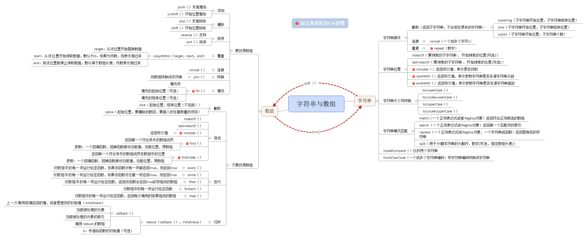

# String API
先祭上一张神图：


## charAt()
charAt() 方法从一个字符串中返回指定的字符。

> str.charAt(index)

* 参数：
  * index：一个介于0 和字符串长度减1之间的整数。 (0~length-1)如果没有提供索引，charAt() 将使用0。

* 返回值： 指定字符

## charCodeAt()
charCodeAt() 方法返回0到65535之间的整数

> str.charCodeAt(index)

* 参数：
  * index：一个大于等于 0，小于字符串长度的整数。如果不是一个数值，则默认为 0。

* 返回值： 返回值是一表示给定索引处（String中index索引处）字符的 UTF-16 代码单元值的数字；如果索引超出范围，则返回 NaN。

```js
"ABC".charCodeAt(0) // returns 65:"A"
```

## concat()【数组也有】
concat() 方法将一个或多个字符串与原字符串连接合并，形成一个新的字符串并返回。更常用的是使用 “+” 进行拼接。

> str.concat(string2, string3[, ..., stringN])

* 参数：
  * string2...stringN：和原字符串连接的多个字符串

* 返回值： 返回值是一个新的字符串。

**不改变原字符串**

## substring()
substring() 方法返回一个字符串在开始索引到结束索引之间的一个子集, 或从开始索引直到字符串的末尾的一个子集。

> str.substring(indexStart[, indexEnd])

* 参数：
  * indexStart：一个 0 到字符串长度之间的整数。
  * indexEnd（可选）：一个 0 到字符串长度之间的整数。

* 返回值： 包含给定字符串的指定部分的新字符串。

**不改变原字符串**

## slice()【数组也有】
slice() 方法提取一个字符串的一部分，并返回一新的字符串。

> str.slice(beginSlice[, endSlice])

* 参数：
  * beginSlice：和原字符串连接的多个字符串。如果值为负数，往后数该数个。
  * endSlice（可选）:在该索引（以 0 为基数）处结束提取字符串。如果省略该参数，slice会一直提取到字符串末尾。如果该参数为负数，往后数该数个。

* 返回值： 返回一个从原字符串中提取出来的新字符串

**不改变原字符串**

## substr()
substr() 方法返回一个字符串中从指定位置开始到指定字符数的字符。

> str.substr(start[, length])

* 参数：
  * start：开始提取字符的位置。如果为负值，往后数该数个。
  * length（可选）:**提取的字符数**。

* 返回值： 返回值是一个新的字符串。

**不改变原字符串**

## repeat()【ES6新增】
repeat() 构造并返回一个新字符串，该字符串包含被连接在一起的指定数量的字符串的副本。

```js
/** 
 * str: String
 * count: Number
 */

let resultString = str.repeat(count);
```

* 参数：
  * count：介于0和正无穷大之间的整数 : [0, +∞) 。表示在新构造的字符串中重复了多少遍原字符串。

* 返回值：  包含指定字符串的指定数量副本的新字符串。

**不改变原字符串**

## indexOf()【数组也有】
indexOf() 方法返回调用  String 对象中第一次出现的指定值的索引，开始在 fromIndex进行搜索。如果未找到该值，则返回-1。

> str.indexOf(searchValue[, fromIndex])

* 参数：
  * searchValue：一个字符串表示被查找的值。
  * fromIndex （可选）:表示调用该方法的字符串中开始查找的位置。可以是任意整数。默认值为 0。如果 fromIndex < 0 则查找整个字符串（如同传进了 0）。如果 fromIndex >= str.length，则该方法返回 -1。当被查找的字符串是一个空字符串，fromIndex <= 0时返回0，0 < fromIndex <= str.length时返回fromIndex，fromIndex > str.length时返回str.length。

* 返回值：指定值的第一次出现的索引; 如果没有找到 -1。

## lastIndexOf()【数组也有】
lastIndexOf() 方法返回指定值在调用该方法的字符串中最后出现的位置，如果没找到则返回 -1。从该字符串的后面向前查找，从 fromIndex 处开始。

> str.lastIndexOf(searchValue[, fromIndex])

* 参数：
  * searchValue：一个字符串表示被查找的值。
  * fromIndex （可选）:从调用该方法字符串的此位置处开始查找。可以是任意整数。默认值为 str.length。如果为负值，则被看作 0。如果 fromIndex > str.length，则 fromIndex 被看作 str.length。

* 返回值：指定值的第一次出现的索引; 如果没有找到 -1。

## includes()【ES6新增】
includes() 方法用于判断一个字符串是否包含在另一个字符串中，根据情况返回 true 或 false。

> str.includes(searchString[, position])

* 参数：
  * searchValue：要在此字符串中搜索的字符串。
  * position （可选）:从当前字符串的哪个索引位置开始搜寻子字符串，默认值为0。

* 返回值：如果当前字符串包含被搜寻的字符串，就返回 true；否则返回 false。

## startsWith()【ES6新增】
startsWith()方法用来判断当前字符串是否是以另外一个给定的子字符串“开头”的，根据判断结果返回 true 或 false。

> str.startsWith(searchString [, position]);

* 参数：
  * searchValue：要搜索的子字符串。
  * position （可选）:在 str 中搜索 searchString 的开始位置，默认值为 0，也就是真正的字符串开头处。

* 返回值：如果当前字符串以另外一个给定的子字符串“开头”，就返回 true；否则返回 false。

## endsWith()【ES6新增】
endsWith()方法用来判断当前字符串是否是以另外一个给定的子字符串“结尾”的，根据判断结果返回 true 或 false。

> str.endsWith(searchString [, position]);

* 参数：
  * searchValue：要搜索的子字符串。
  * position （可选）:作为str的长度，默认值为 str.length。

* 返回值：true 如果传入的子字符串在搜索字符串的末尾；否则将返回 false

```js
var s = 'Hello world';
s.startsWith('world',6);	// true
s.endsWith('Hello',5);		// true
s.includes('Hello',6);		//false
```
注意：
使用第2个参数n时，endsWith的行为与其他两个方法有所不同。它针对前面n个字符，而其他两个方法针对从第n个位置开始直到字符串结束的字符。

## trim()
trim() 方法会从一个字符串的两端删除空白字符。在这个上下文中的空白字符是所有的空白字符 (space, tab, no-break space 等) 以及所有行终止符字符（如 LF，CR）。

> str.trim()

trim() 方法并不影响原字符串本身，它返回的是一个新的字符串。

Chrome 8+还支持非标准的 trimLeft()和 trimRight()方法，分别用于删除字符串开头和末尾的
空格。

**不改变原字符串**

## toLowerCase()、toLocaleLowerCase()、toUpperCase()和 toLocaleUpperCase()

## match()
当一个字符串与一个正则表达式匹配时， match()方法检索匹配项。

> str.match(regexp);

* 参数：
  * regexp：一个正则表达式对象。如果传入一个非正则表达式对象，则会隐式地使用 new RegExp(obj) 将其转换为一个 RegExp 。如果你未提供任何参数，直接使用 match() ，那么你会得到一个包含空字符串的 Array ：[""] 。

* 返回值： 如果字符串匹配到了表达式，会返回一个数组，数组的第一项是进行匹配完整的字符串，之后的项是用圆括号捕获的结果。如果没有匹配到，返回null

**在字符串上调用这个方法本质上与调用RegExp的exec()方法相同。**

```js
var text = "cat, bat, sat, fat";  
var pattern = /.at/; 
 
//与 pattern.exec(text)相同 
var matches = text.match(pattern);         
alert(matches.index);             //0 
alert(matches[0]);                 //"cat" 
alert(pattern.lastIndex);          //0
```

## search()
search() 方法执行正则表达式和 String对象之间的一个搜索匹配。

> str.search(regexp)

* 参数：
  * regexp：一个正则表达式（regular expression）对象。如果传入一个非正则表达式对象，则会使用 new RegExp(obj) 隐式地将其转换为正则表达式对象。

* 返回值： 如果匹配成功，则 search() 返回正则表达式在字符串中首次匹配项的索引。否则，返回 -1。

```js
var text = "cat, bat, sat, fat";  
var pos = text.search(/at/); 
alert(pos);   //1
```

## replace()
replace() 方法返回一个由替换值替换一些或所有匹配的模式后的新字符串。模式可以是一个字符串或者一个正则表达式, 替换值可以是一个字符串或者一个每次匹配都要调用的函数。

> str.replace(regexp|substr, newSubStr|function)

* 参数：
  * regexp (pattern)：一个RegExp 对象或者其字面量。该正则所匹配的内容会被第二个参数的返回值替换掉。在进行全局的搜索替换时，正则表达式需包含 g 标志。
  * substr (pattern):一个要被 newSubStr 替换的字符串。其被视为一整个字符串，而不是一个正则表达式。仅仅是第一个匹配会被替换。
  * newSubStr (replacement):用于替换掉第一个参数在原字符串中的匹配部分的字符串。该字符串中可以内插一些特殊的变量名。
  * function (replacement):一个用来创建新子字符串的函数，该函数的返回值将替换掉第一个参数匹配到的结果。

* 返回值： 一个部分或全部匹配由替代模式所取代的新的字符串。

利用replace()进行替换的时候，如果传入的是字符串，则只会替换第一个子字符串，要想替换所有的子字符串，则需要传入一个正则表达式，而且要指定全局（g）标志

```js
var text = 'cat , bat , sat , fat';
var result = text.replace('at','ond');
console.log(result); // =>'cont , bat , sat , fat'

result = text.replace(/at/g,'ond');
console.log(result); //=>'cont , bont , sont , font'
```
当第二个参数为函数时函数的返回值作为替换字符串。与第二个参数是字符串一样，如果第一个参数是正则表达式，并且全局匹配，则这个函数的方法将被多次调用，每次匹配都会被调用。
```js
function replacer(match , p1 , p2 , p3 , offset , string){
	// p1 is nondigits, p2 digits, and p3 non-alphanumerics
    console.log(`${match}
				 ${p1}
				 ${p2}
				 ${p3}
				 ${offset}
				 ${string}`); 
	/* => abc12345#$*%
         abc
         12345
         #$*%
         0
         abc12345#$*%"	*/		 
    console.log([p1, p2, p3].join(' - ')); // => "abc - 12345 - #$*%"
    return [p1, p2, p3].join(' - ');
}
var newString = 'abc12345#$*%'.replace(/([^\d]*)(\d*)([^\w]*)/, replacer); // =>"abc - 12345 - #$*%"

```

**不改变原字符串**

## split()
split() 方法使用指定的分隔符字符串将一个String对象分割成字符串数组，以将字符串分隔为子字符串，以确定每个拆分的位置。 

> str.split([separator[, limit]])

* 参数：
  * separator：指定表示每个拆分应发生的点的字符串。separator 可以是一个字符串或正则表达式。如果分隔符为空字符串，则将str原字符串中每个字符的数组形式返回。
  * limit （可选）:一个整数，限定返回的分割片段数量。

* 返回值：返回源字符串以分隔符出现位置分隔而成的一个 Array 

```js
var color = 'red,blue,yellow,black';
var color1 = color.split(',');		// =>['red','blue','yellow','black']
var color2 = color.split(',',2);	// =>['red','blue']
var color3 = color.split(/[^\,]+/); // =>["", ",", ",", ",", ""]
```
最后一个调用split的时候，出现了前后的两个空白，是因为通过正则表达式指定的分隔符出现在了字符串的开头和结尾。

## localeCompare()
localeCompare() 方法返回一个数字来指示一个参考字符串是否在排序顺序前面或之后或与给定字符串相同。

> referenceStr.localeCompare(compareString[, locales[, options]])

这个方法用于比较两个字符串，并返回下列值中的一个：

* 如果字符串在字母表中应该排在字符串参数之前，则返回负数（大多情况下为-1）
* 如果相等，则返回0
* 如果排在字符串参数之前，则返回正数（大多数情况下为1）

```js
'a'.localeCompare('c'); // -1

'check'.localeCompare('against'); // 1

'a'.localeCompare('a'); // 0
```

## fromCharCode()
静态 String.fromCharCode() 方法返回使用指定的Unicode值序列创建的字符串。

> String.fromCharCode(num1, ..., numN) 


* 参数：
  * num1, ..., numN：一组序列数字，表示 Unicode 值。

* 返回值：一个字符串，而不是一个 String 对象。

```js
String.fromCharCode(65,66,67) // ABC
```

## 最后
```js
let s = 'hello';
let news = s.split('').reverse().join('');
console.log(news); // => "olleh"
```