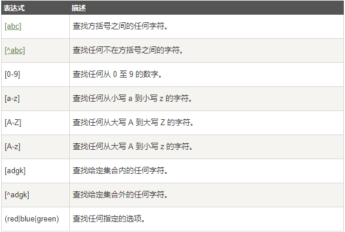
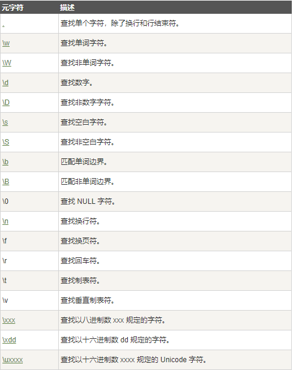
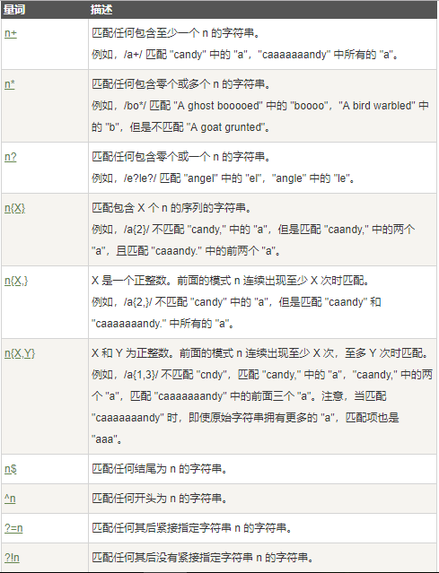
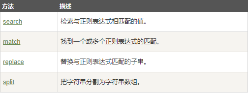

# 正则表达式
> RegExp

* [创建RegExp对象](#创建RegExp对象)
* [API](#api)
* [基础实例](#基础实例)
* [进阶实例](#进阶实例)
* [切分字符串](#切分字符串)
* [分组](#分组)
* [贪婪匹配](#贪婪匹配)
* [常用实例集合](#常用实例集合)
* [先行断言lookahead和后行断言lookbehind](#先行断言lookahead和后行断言lookbehind)

## 创建RegExp对象
* 字面量方法
```js
var patt=/pattern/modifiers;
```
* 构造方法
```js
var patt=new RegExp(pattern,modifiers);
```
pattern（模式） 描述了表达式的模式  
modifiers(修饰符) 用于指定全局匹配、区分大小写的匹配和多行匹配
```js
var re1 = /ABC\-001/;
var re2 = new RegExp('ABC\\-001');

re1; // /ABC\-001/
re2; // /ABC\-001/
//注意构造函数的字符串转义问题
```

## API
[建议去官网对照API](https://developer.mozilla.org/zh-CN/docs/Web/JavaScript/Guide/Regular_Expressions)
### 修饰符
> 用于执行区分大小写和全局匹配

| 修饰语  | 作用        |
| --------| ------------|
| i       | 忽略大小写  |
| g       | 全局搜索    |
| m       | 多行        |


### 方括号
> 方括号用于查找某个范围内的字符



### 元字符
> 是拥有特殊含义的字符,都是匹配一个字符



### 量词



### RegExp 对象方法


### 支持正则表达式的 String 对象的方法



## 基础实例
* ```\d```可以匹配一个数字，```\w```可以匹配一个字母或数字或下划线，```\s```匹配一个空白字符，包括空格、制表符、换页符和换行符
```
'00\d'可以匹配'007'，但无法匹配'00A'；
'\d\d\d'可以匹配'010'；
'\w\w'可以匹配'js','j3','90','9_'
```

* ```.```可以匹配任意一个字符
```
'js.'可以匹配'jsp'、'jss'、'js!'等等
```

* 要匹配变长的字符，用```*```表示任意个字符（包括0个），用```+```表示至少一个字符，用```?```表示0个或1个字符，用```{n}```表示n个字符，用```{n,m}```表示n-m个字符
```
\d{3}\s+\d{3,8}
可以匹配以任意个空格隔开的带区号的电话号码。

\d{3}\-\d{3,8}
可以匹配'010-12345'
```

## 进阶实例
* []表示范围
```
1.[0-9a-zA-Z\_]可以匹配一个数字、字母或者下划线；
2.[0-9a-zA-Z\_]+可以匹配至少由一个数字、字母或者下划线组成的字符串，比如'a100'，'0_Z'，'js2015'等等；
3.[a-zA-Z\_\$][0-9a-zA-Z\_\$]*可以匹配由字母或下划线、$开头，后接任意个由一个数字、字母或者下划线、$组成的字符串，也就是JavaScript允许的变量名；
4.[a-zA-Z\_\$][0-9a-zA-Z\_\$]{0, 19}更精确地限制了变量的长度是1-20个字符（前面1个字符+后面最多19个字符）。
```

* A|B可以匹配A或B
```
(J|j)ava(S|s)cript可以匹配'JavaScript'、'Javascript'、'javaScript'或者'javascript'
```

* ^表示行的开头，^\d表示必须以数字开头
* $表示行的结束，\d$表示必须以数字结束
* js也可以匹配'jsp'，但是加上^js$就变成了整行匹配，就只能匹配'js'了

## 切分字符串
```
'a,b;; c  d'.split(/[\s\,\;]+/); // ['a', 'b', 'c', 'd']
```

## 分组
```
var re = /^(\d{3})-(\d{3,8})$/;
re.exec('010-12345'); // ['010-12345', '010', '12345']
re.exec('010 12345'); // null
```
exec()方法在匹配成功后，会返回一个Array，第一个元素是正则表达式匹配到的整个字符串，后面的字符串表示匹配成功的子串。

exec()方法在匹配失败时返回null。
```
var re = /^(0[0-9]|1[0-9]|2[0-3]|[0-9])\:(0[0-9]|1[0-9]|2[0-9]|3[0-9]|4[0-9]|5[0-9]|[0-9])\:(0[0-9]|1[0-9]|2[0-9]|3[0-9]|4[0-9]|5[0-9]|[0-9])$/;
re.exec('19:05:30'); // ['19:05:30', '19', '05', '30']
```

## 贪婪匹配
需要特别指出的是，**正则匹配默认是贪婪匹配**，也就是匹配尽可能多的字符。举例如下，匹配出数字后面的0：
```
var re = /^(\d+)(0*)$/;
re.exec('102300'); // ['102300', '102300', '']
```
由于\d+采用贪婪匹配，直接把后面的0全部匹配了，结果0*只能匹配空字符串了。  

必须让\d+采用非贪婪匹配（也就是尽可能少匹配），才能把后面的0匹配出来，加个?就可以让\d+采用非贪婪匹配：
```
var re = /^(\d+?)(0*)$/;
re.exec('102300'); // ['102300', '1023', '00']
```
几个常用的非贪婪匹配Pattern
```
*? 重复任意次，但尽可能少重复  
+? 重复1次或更多次，但尽可能少重复  
?? 重复0次或1次，但尽可能少重复  
{n,m}? 重复n到m次，但尽可能少重复  
{n,}? 重复n次以上，但尽可能少重复 
```

## 常用实例集合
1. 匹配Email地址
```
var re = /^[\w][\w\.]+?@[\w]+\.(com|org)$/;
console.log(re.test('someone@gmail.com'));
console.log(re.test('bill.gates@microsoft.com'));
console.log(re.test('tom@voyager.org'));
console.log(re.test('.eee@88.com'));
```

2. 切分前后有任意空格的字符串
```
var re = /\s+/;
console.log('s a   adbv'.split(re)); // ["s", "a", "adbv"]
```

3.匹配家庭电话
```
var re = /\d{4}\-\d{7}/;
console.log(re.test('0760-2222222')); // true
console.log(re.test('0760 - 2222222')); // false
```

4.截取url中的参数
```js
var pair = /[\?&]([\w]+)=([^&#]+)/g;
var url = 'https://www.liaoxuefeng.com/wiki?key=value&hh=dd&kk=ee';
var s = null,res = [];
while((s = pair.exec(url))!=null){
  res.push(s[1],s[2]);
}

console.log(res);
```

## 先行断言(lookahead)
* (?=pattern) 零宽正向先行断言(zero-width positive lookahead assertion) 
* (?!pattern) 零宽负向先行断言(zero-width negative lookahead assertion) 

如同^代表开头，$代表结尾，\b代表单词边界一样，先行断言和后行断言也有类似的作用，它们只匹配某些位置，在匹配过程中，不占用字符，所以被称为“零宽”。所谓位置，是指字符串中(每行)第一个字符的左边、最后一个字符的右边以及相邻字符的中间（假设文字方向是头左尾右）。 

### (?=pattern) 正向先行断言 
代表字符串中的一个**位置**，**紧接该位置之后**的字符序列**能够匹配**pattern。 

例如对”a regular expression”这个字符串，要想匹配regular中的re，但不能匹配expression中的re，可以用”re(?=gular)”，该表达式限定了re右边的位置，这个位置之后是gular，但并不消耗gular这些字符，将表达式改为”re(?=gular).”，将会匹配reg，元字符.匹配了g，括号这一砣匹配了e和g之间的位置。

### (?<=pattern) 正向后行断言 
代表字符串中的一个位置，紧接该位置之前的字符序列能够匹配pattern。 

例如对”regex represents regular expression”这个字符串，有4个单词，要想匹配单词内部的re，但不匹配单词开头的re，可以用”(?<=\w)re”，单词内部的re，在re前面应该是一个单词字符。之所以叫后行断言，是因为正则表达式引擎在匹配字符串和表达式时，是从前向后逐个扫描字符串中的字符，并判断是否与表达式符合，当在表达式中遇到该断言时，正则表达式引擎需要往字符串前端检测已扫描过的字符，相对于扫描方向是向后的。