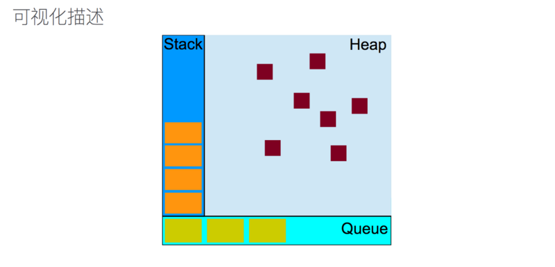
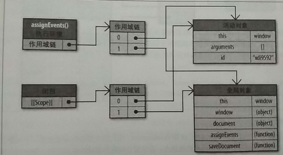

* [闭包](#闭包)
* [循环和闭包](#循环和闭包)
* [利用闭包实现模块化开发](#利用闭包实现模块化开发)
* [闭包的优缺点](#闭包的优缺点)
* [闭包面试题](#闭包面试题)

# 闭包
> closure
## 闭包
> 闭包就是能够读取其他函数内部变量的函数
```
function foo(){  
  var a = 2;  
  function bar(){  
     console.log(a);  
   }  
   bar();  
}  
foo(); // 2
```
你是否会疑惑，为什么函数 foo 已经弹出调用栈了，为什么函数 bar 还能引用到函数 foo 中的变量。因为函数 foo 中的变量这时候是存储在堆上的。现在的 JS 引擎可以通过逃逸分析辨别出哪些变量需要存储在堆上，哪些需要存储在栈上。

## 循环和闭包
```
for (var i = 0; i < 5; i++) {
    setTimeout(function() {
        console.log('i: ',i);
    }, 1000);
}

console.log(i);

//输出
5
i:  5
i:  5
i:  5
i:  5
i:  5
```

* 同步任务都在主线程上执行，形成一个执行栈
* 主线程之外，事件触发线程管理着一个消息队列，只要异步任务有了运行结果，就在任务队列之中放置一个事件。
* 一旦执行栈中的所有同步任务执行完毕（此时JS引擎空闲），系统就会读取消息队列，将可运行的异步任务添加到可执行栈中，开始执行。



上述代码中使用定时器，当JS引擎线程执行到该段代码，便把定时器放到定时器线程去计时，此时JS引擎线程执行同步栈里面的任务。当定时器计时完成之后，将回调函数推入消息队列。等待栈中的代码执行完毕之后会去读取消息队列中的事件。


由于JS的**函数作用域**，当回调函数被推入消息队列的时候没有带上参数。for循环结束之后，因为i是用var定义的，所以var是全局变量（这里没有函数，如果有就是函数内部的变量），这个时候的i是5。

如何解决？

```
//let 是块级作用域，当前块是循环体
for (let i = 0; i < 5; ++i) {
    setTimeout(function() {
        console.log('2: ',i);
    }, 1000);
}

console.log(i);

//输出
i is not defined
2:  0
2:  1
2:  2
2:  3
2:  4
```

```
//这是函数级作用域
for (var i = 0; i < 5; ++i) {
  (function (){
    var j = i;
    setTimeout(function() {
        console.log('2: ',j);
    }, 1000);
  })();
}

console.log(i);
//输出
i is not defined
2:  0
2:  1
2:  2
2:  3
2:  4
```

```
//或者采取传参的方式，使用了闭包
for (var i = 0; i < 5; ++i) {
  (function (j){
    setTimeout(function() {
        console.log('2: ',j);
    }, 1000);
  })(i);
}

console.log(i);
//输出
i is not defined
2:  0
2:  1
2:  2
2:  3
2:  4
```
```JS
//  setTimeout 的第三个参数
for ( var i=1; i<=5; i++) {
	setTimeout( function timer(j) {
		console.log( j );
	}, i*1000, i);
}
```
## 闭包使用场景
### 利用闭包实现模块化开发
1. 模块模式

封装了私有变量和方法，而只暴露了一个接口供其他部分调
```
function cool(){  
  var a = 'cool';  
  var b = [1,2,3];  
  function doA(){  
    console.log(a);  
  }  
  function doB(){  
     console.log(b.join("!"));  
   }  
   return{  
      doA:doA,  
      doB:doB  
   };  
}  
var foo = cool();  
foo.doA();//cool  
foo.doB();//1!2!3  
```
cool()返回一个用对象字面量语法表示的对象

这个对象中含有**内部函数而不是内部数据变量的引用**，保持内部数据变量是隐藏且私有的状态

doA()和doB()函数具有**涵盖模块实例内部作用域的闭包**，当通过返回一个含有属性引用的对象的方式来将函数传到词法作用域外时，已经创建了闭包。

* 模块模式必须要有外部的封闭函数，该函数必须至少被调用一次（每次调用都会创建一个新的模块实例）
* 封闭函数必须返回至少一个内部函数，这样内部函数才能在私有作用域中形成闭包，并且可以访问或者修改私有状态。


2. 单例模式
```
var foo = (function cool(){  
  var a = 'cool';  
  var b = [1,2,3];  
  function doA(){  
    console.log(a);  
  }  
  function doB(){  
     console.log(b.join("!"));  
   }  
   return{  
      doA:doA,  
      doB:doB  
   };  
})();
var foo = cool();  
foo.doA();//cool  
foo.doB();//1!2!3 
```
将模块函数转换成立IIFE，立即调用这个函数并将返回值直接赋值给单例的模块实例标识符foo

### 利用闭包模拟块级作用域
```
var data = [];
for(var i = 0; i < 3; i++){
  (function(){
    var j=i;
    data[j] = function(){
      console.log(j);
    };
  })();
}
data[0]();//0
data[1]();//1
data[2]();//2
```

## 闭包的优缺点
### 优点
1. 希望一个变量长期驻扎在内存中 
2. 避免全局变量的污染 
3. 私有成员的存在

我们可以通过闭包来实现一个计数器，而不用担心全局变量的污染：
```
　function f1(){
　　　　var n=999;
　　　　nAdd=function(){n+=1}//全局变量
　　　　function f2(){
　　　　　　alert(n);
　　　　}
　　　　return f2;
　　}
　　var result=f1();
　　result(); // 999
　　nAdd();
　　result(); // 1000
```

### 缺点
```
function assignEvent(){
  var id = "123";
  document.getElementById("save-btn").onclick = function(event){
     saveDocument(id);
  }
}
```


函数的活动对象会随着执行环节一同销毁。但引入闭包，由于引用仍然存在于闭包的[[Scope]]属性中，因此激活对象无法被销毁。


id在作用域链的第一个对象之后。因此，将常用的跨作用域变量存储在局部变量中，然后直接访问局部变量。比使用闭包带来的内存和执行速度开销要好。

## 闭包面试题
> 题目：现在有个 HTML 片段，要求编写代码，点击编号为几的链接就alert弹出其编号

```
<ul>
    <li>编号1，点击我请弹出1</li>
    <li>2</li>
    <li>3</li>
    <li>4</li>
    <li>5</li>
</ul>
```
一般不知道这个题目用闭包的话，会写出下面的代码：
```
var list = document.getElementsByTagName('li');
for (var i = 0; i < list.length; i++) {
    list[i].addEventListener('click', function(){
        alert(i + 1)
    }, true)
}
```
实际上执行才会发现始终弹出的是6，这时候就应该通过闭包来解决：
```
var list = document.getElementsByTagName('li');
for (var i = 0; i < list.length; i++) {
    list[i].addEventListener('click', function(i){
        return function(){
            alert(i + 1)
        }
    }(i), true)
}
```


