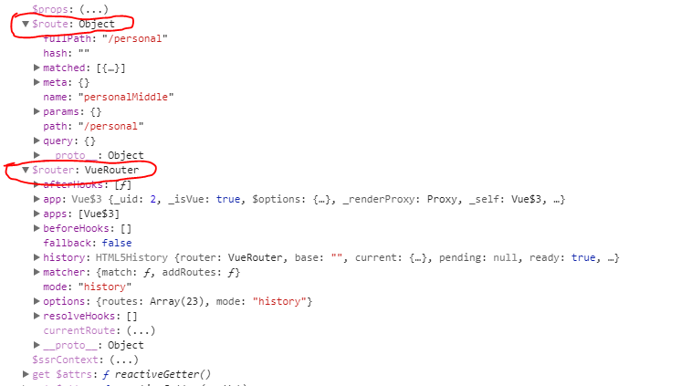

# this.$route和this.$router

## 路由对象
一个**路由对象** (route object) 表示当前激活的路由的状态信息，包含了当前 URL 解析得到的信息，还有 URL 匹配到的**路由记录** (route records)。

路由对象是不可变 (immutable) 的，每次成功的导航后都会产生一个新的对象。

路由对象出现在多个地方:
* 在组件内，即 this.$route
* 在 $route 观察者回调内
* router.match(location) 的返回值
* 导航守卫的参数：
```js
router.beforeEach((to, from, next) => {
  // `to` 和 `from` 都是路由对象
})
```
* scrollBehavior 方法的参数:
```js
const router = new VueRouter({
  scrollBehavior (to, from, savedPosition) {
    // `to` 和 `from` 都是路由对象
  }
})
```

### 路由对象属性
* $route.path
  * 类型: string
  * 字符串，对应当前路由的路径，总是解析为绝对路径，如 "/foo/bar"。

* $route.params
  * 类型: Object
  * 一个 key/value 对象，包含了动态片段和全匹配片段，如果没有路由参数，就是一个空对象。

* $route.query
  * 类型: Object
  * 一个 key/value 对象，表示 URL 查询参数。例如，对于路径 /foo?user=1，则有 $route.query.user == 1，如果没有查询参数，则是个空对象。

* $route.hash
  * 类型: string
  * 当前路由的 hash 值 (带 #) ，如果没有 hash 值，则为空字符串。

* $route.fullPath
  * 类型: string
  * 完成解析后的 URL，包含查询参数和 hash 的完整路径。

* $route.matched
  * 类型: Array<RouteRecord>
  * 一个数组，包含当前路由的所有嵌套路径片段的路由记录 。路由记录就是 routes 配置数组中的对象副本 (还有在 children 数组)。
```js
const router = new VueRouter({
  routes: [
    // 下面的对象就是路由记录
    { path: '/foo', component: Foo,
      children: [
        // 这也是个路由记录
        { path: 'bar', component: Bar }
      ]
    }
  ]
})
```
当 URL 为 /foo/bar，$route.matched 将会是一个包含从上到下的所有对象 (副本)。

* $route.name
  * 当前路由的名称，如果有的话。(查看命名路由)

* $route.redirectedFrom
  * 如果存在重定向，即为重定向来源的路由的名字。(参阅重定向和别名)

## Router
### Router 实例属性
* router.app
  * 类型: Vue instance
  * 配置了 router 的 Vue 根实例。

* router.mode
  * 类型: string
  * 路由使用的模式。

* router.currentRoute
  * 类型: Route
  * 当前路由对应的路由信息对象。

### Router 实例方法
* router.beforeEach
* router.beforeResolve
* router.afterEach
```js
router.beforeEach((to, from, next) => {
  /* must call `next` */
})

router.beforeResolve((to, from, next) => {
  /* must call `next` */
})

router.afterEach((to, from) => {})
```

* router.push
* router.replace
* router.go
* router.back
* router.forward
```js
router.push(location, onComplete?, onAbort?)
router.replace(location, onComplete?, onAbort?)
router.go(n)
router.back()
router.forward()
```
[编程式的导航](https://router.vuejs.org/zh/guide/essentials/navigation.html)

* router.getMatchedComponents
```js
const matchedComponents: Array<Component> = router.getMatchedComponents(location?)
```
返回目标位置或是当前路由匹配的组件数组 (是数组的定义/构造类，不是实例)。通常在服务端渲染的数据预加载时时候。

* router.resolve
```js
const resolved: {
  location: Location;
  route: Route;
  href: string;
} = router.resolve(location, current?, append?)
```
解析目标位置 (格式和 <router-link> 的 to prop 一样)。

1. current 是当前默认的路由 (通常你不需要改变它)
2. append 允许你在 current 路由上附加路径 (如同 router-link)

* router.addRoutes
```js
router.addRoutes(routes: Array<RouteConfig>)
```
动态添加更多的路由规则。参数必须是一个符合 routes 选项要求的数组。

* router.onReady
```js
router.onReady(callback, [errorCallback])
```
该方法把一个回调排队，在路由完成初始导航时调用，这意味着它可以解析所有的异步进入钩子和路由初始化相关联的异步组件。

这可以有效确保服务端渲染时服务端和客户端输出的一致。

第二个参数 errorCallback 只在 2.4+ 支持。它会在初始化路由解析运行出错 (比如解析一个异步组件失败) 时被调用。

* router.onError
```js
router.onError(callback)
```
注册一个回调，该回调会在路由导航过程中出错时被调用。注意被调用的错误必须是下列情形中的一种：

错误在一个路由守卫函数中被同步抛出；

错误在一个路由守卫函数中通过调用 next(err) 的方式异步捕获并处理；

渲染一个路由的过程中，需要尝试解析一个异步组件时发生错误。

## this.$route 和 this.$router
控制台打印 this



$route为当前router跳转对象里面可以获取name、path、query、params等

$router为VueRouter实例，想要导航到不同URL，则使用$router.push方法

返回上一个history也是使用$router.go方法

常用的也就以上几种情况

> 