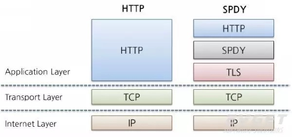
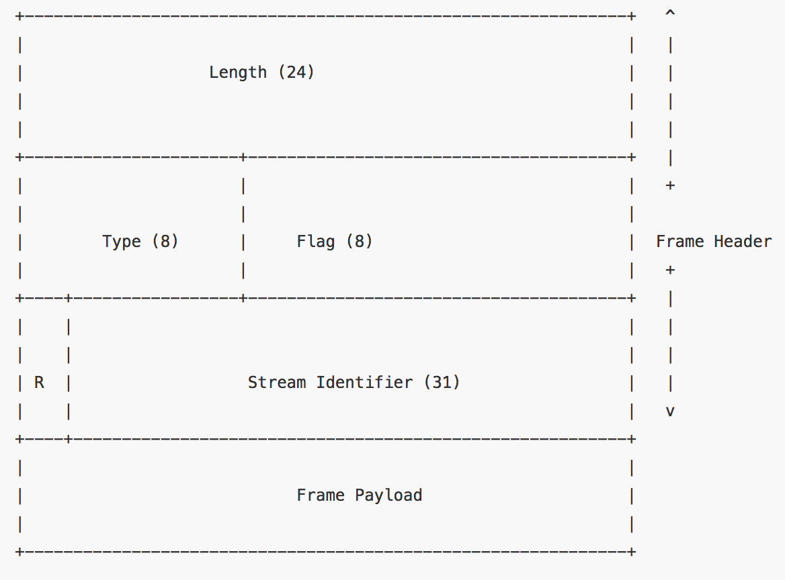
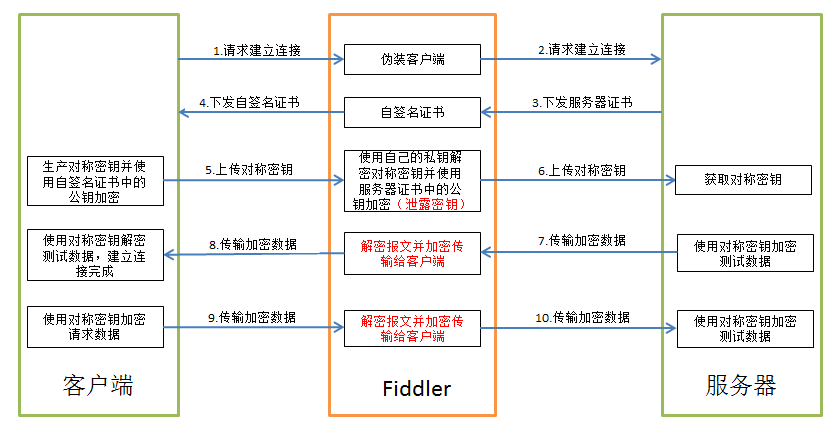

# HTTP
## 历史
### HTTP/0.9
1990年提出的，是最早期的版本，只有一个命令GET。

### HTTP/1.0
1996年5月提出的。

* 缺点：每个TCP连接只能发送一个请求。
* 解决方法：Connection：keep-alive

### HTTP/1.1
1997年1月提出，现在使用最广泛的。

* **长连接**：TCP连接默认不关闭，可以被多个请求复用。对于同一个域名，大多数浏览器允许同时建立6个持久连接。默认开启Connection：keep-alive。
* **管道机制**：在同一个TCP连接里，可以同时发送多个请求。但是服务器还是要按照请求的顺序进行响应，会造成“队头阻塞”。

## HTTP 报文结构
### 请求报文


### 响应报文


### 报文首部
1. **通用首部字段**

* Cache-Control：操作缓存的工作机制
  * public：明确表明其他用户也可以利用缓存
  * private：缓存只给特定的用户
  * no-cache：客户端发送这个指令，表示客户端不接收缓存过的响应，必须到服务器取；服务器返回这个指令，指缓存服务器不能对资源进行缓存。其实是不缓存过期资源，要向服务器进行有效期确认后再处理资源。
  * no-store：指不进行缓存
  * max-age：缓存的有效时间（相对时间）

* Connection：
  * Connection：keep-Alive (持久连接)
  * Connection：Upgrade (表示要升级协议)

* Date：表明创建http报文的日期和时间

* Pragma：兼容http1.0，与Cache-Control：no-cache含义一样。但只用在客户端发送的请求中，告诉所有的中间服务器不返回缓存。形式唯一：Pragma：no-cache

* Trailer：会事先说明在报文主体后记录了哪些首部字段，该首部字段可以应用在http1.1版本分块传输编码中。

* Transfer-Encoding：chunked （分块传输编码）,
规定传输报文主体时采用的编码方式，http1.1的传输编码方式只对分块传输编码有效

* Upgrade：升级一个成其他的协议，需要额外指定Connection：Upgrade。服务器可用101状态码作为相应返回。

* Via：追踪客户端和服务器之间的请求和响应报文的传输路径。可以避免请求回环发生，所以在经过代理时必须要附加这个字段。

2. **请求首部字段**

* Accept：通知服务器，用户代理能够处理的媒体类型及媒体类型的相对优先级
q表示优先级的权重值，默认为q = 1.0，范围是0~1（可精确到小数点后3位，1为最大值）
当服务器提供多种内容时，会先返回权重值最高的媒体类型

* Accept-Charset：支持的字符集及字符集的相对优先顺序，跟Accept一样，用q来表示相对优先级。这个字段应用于内容协商机制的服务器驱动协商。

* Accept-Encoding：支持的内容编码及内容编码的优先级顺序，q表示相对优先级。
内容编码：gzip、compress、deflate、identity（不执行压缩或者不会变化的默认编码格式）。
可以使用*作为通配符，指定任意的编码格式。

* Accept-Language：能够处理的自然语言集，以及相对优先级。

### 状态码
**101 协议升级**，主要用于升级到websocket，也可以用于http2

**200 OK**

**204 No content**，服务器成功处理请求，但是返回的响应报文中不含实体的主体部分

**206 Partial Content**，表示客户端像服务器进行了范围请求（Content-Range字段），服务器成功返回指定范围的实体内容

**301 永久性重定向**，表示请求的资源已经被分配了新的url，旧地址以后都不能再访问了，服务器会返回location字段，包含的是新的地址。

**302 临时性重定向**，表示请求的资源临时移动到一个新地址

> 注意：尽量使用301跳转，因为302会造成网址劫持，可能被搜索引擎判为可疑转向，甚至认为是作弊。
> 
> 原因：从网站A（网站比较烂）上做了一个302跳转到网站B（搜索排名很靠前），这时候有时搜索引擎会使用网站B的内容，但却收录了网站A的地址，这样在不知不觉间，网站B在为网站A作贡献，网站A的排名就靠前了。

**303 See Other**，与302功能相同，但是它明确规定客户端应采用GET方法获取资源

**304 未修改**，协商缓存中返回的状态码

**307 临时重定向**，与302功能相同，但规定不能从POST变成GET

> 当301、302、303响应状态码返回时，几乎所有浏览器都会把post改成get，并删除请求报文内的主体，之后请求会自动再次发送。然而301、302标准是禁止将post方法改变成get方法的，但实际使用时大家都会这么做。所以需要307。

**400 Bad Request，**表示请求报文中存在语法错误。当错误发生时，需要修改请求的内容再次发送请求

**401 unauthorized**，表示发送的请求需要有通过HTTP认证（BASIC认证、DIGEST认证）的认证信息。如果之前已经进行过一次请求，表示用户认证失败。

**403 禁止**，表示拒绝对请求资源的访问

**404 Not Found**，表明服务器上无法找到请求的资源

**500 Internet Server Error**，该状态码表示服务器在执行请求时发生了错误

**503 Service Unavailable**，表示服务器暂时处于超负荷或者处于停机维护状态，现在无法处理请求

## SPDY协议
2009年谷歌提出。
* SPDY结构： SPDY协议是Google提出的基于传输控制协议(TCP)的应用层协议,通过压缩、多路复用和优先级来缩短加载时间。该协议是一种更加快速的内容传输协议。



* 新增特性：
  * 多路复用：通过一个TCP连接，可以无限制处理多个HTTP请求。
  * 赋予请求优先级：给请求逐个分配优先级顺序。可以解决在发送多个请求时，因带宽低而导致响应变慢的问题。
  * 压缩HTTP首部：压缩方式：DELEFT
  * 推送功能
  * 服务器提示功能：服务器可以主动提示客户端请求所需的资源。

* 缺点：
  * SPDY强制使用https。而且SPDY基本上只是将单个域名下的通信多路复用，所以当一个web网站上使用多个域名下的资源时，改善效果就会受到限制。

## WebSocket
html5新提出来的，是web浏览器与web服务器之间的全双工通信标准。主要是为了解决ajax和comet里的xmlhttprequest附带的缺陷所引起的问题。

### 特性
（1）推送功能：服务器可直接发送数据，不需要等待客户端的请求；

（2）基于TCP传输协议，并复用HTTP的握手通道；

（3）支持双向通信，用于实时传输消息；

（4）更好的二进制支持；

（5）更灵活，更高效。

### 建立连接过程
1. **客户端：发起协议升级请求**
```
GET / HTTP/1.1      `采用HTTP报文格式，只支持get请求`
Host: localhost:8080    
Origin: http://127.0.0.1:3000 
Connection: Upgrade   `表示要升级协议`
Upgrade: websocket    `表示升级到websocket协议`
Sec-WebSocket-Version: 13    `表示websocket 的版本`
Sec-WebSocket-Key: w4v7O6xFTi36lq3RNcgctw==   `是一个 Base64 encode 的值，是浏览器随机生成的`
Sec-WebSocket-Protocol：chat, superchat  `用来指定一个特定的子协议，一旦这个字段有设置，那么服务器需要在建立连接的响应头中包含同样的字段，内容就是选择的子协议之一。`
```

2. **服务端：响应协议升级**
```
HTTP/1.1 101 Switching Protocols    `101表示协议切换==`
Connection:Upgrade
Upgrade: websocket
Sec-WebSocket-Accept: Oy4NRAQ13jhfONC7bP8dTKb4PTU= `经过服务器确认，并且加密过后的 Sec-WebSocket-Key`
Sec-WebSocket-Protocol：chat  `表示最终使用的协议`
```

Sec-WebSocket-Key 的加密过程为：

> 1、将Sec-WebSocket-Key跟258EAFA5-E914-47DA-95CA-C5AB0DC85B11拼接。  
> 2、通过SHA1计算出摘要，并转成base64字符串。

### Ajax 轮询、长轮询、WebSocket原理解析
1、**ajax轮询**

让浏览器每隔一定的时间就发送一次请求，询问服务器是否有新信息。

2、**长轮询（Long Poll）**

采用的阻塞模式。客户端发起连接后，如果没消息，服务器不会马上告诉你没消息，而是将这个请求挂起（pending），直到有消息才返回。返回完成或者客户端主动断开后，客户端再次建立连接，周而复始。Comet就是采用的长轮询。

3、**websocket**

WebSocket 是类似 Socket 的TCP长连接通讯模式。一旦 WebSocket 连接建立后，后续数据都以帧序列的形式传输。而且浏览器和服务器就可以随时主动发送消息给对方，是全双工通信。

优点：在海量并发及客户端与服务器交互负载流量大的情况下，极大的节省了网络带宽资源的消耗，有明显的性能优势，且客户端发送和接受消息是在同一个持久连接上发起，实时性优势明显。

## HTTP2
2015年发布，它是基于SPDY的，以下是它的一些新特性：

1、 **二进制分帧**：

http/1.x 是一个超文本协议，而 http2 是一个二进制协议，被称之为二进制分帧。二进制格式在协议的解析和优化扩展上带来更多的优势和可能。

协议格式为帧，帧由 Frame Header（头信息帧）和 Frame Payload（数据帧）组成，如下所示：



* Length 字段用来表示 Frame Payload 数据大小。
* Type 字段用来表示该帧中的 Frame Payload 保存的是 header 数据还是 body 数据。除了用于标识 header/body，还有一些额外的 Frame Type。
* Stream Identifier 用来标识该 frame 属于哪个 stream。
* Frame Payload 用来保存 header 或者 body 的数据。

2、**头部压缩 HPACK**：
请求和响应首部压缩，客户端和服务端共同维护一张头信息表，所有字段存入这个表，生成一个索引号，通过发送索引号提高速度。HPACK压缩会经过两步:

* 传输的value,会经过一遍Huffman coding来节省资源；
* 为了server和client同步, 两边都需要保留一份Header list, 并且,每次发送请求时,都会检查更新。

3、**服务端推送**：

服务端主动向客户端推送数据。如果客户端请求一个html文件，服务端把html文件返回给客户端之后，还会相应的把html文件中的js、css、图片推送给客户端。

4、**多路复用**：

只需要建立一个TCP连接，浏览器和服务器可以同时发送多个请求或者回应，而且不需要按照顺序一一对应，避免了“队头阻塞”。

5、**数据流**：

当客户端同时向服务端发起多个请求，那么这些请求会被分解成一一个的帧，每个帧都会在一个 TCP 链路中无序的传输，同一个请求的帧的 Stream Identifier 都是一样的。当帧到达服务端之后，就可以根据 Stream Identifier 来重新组合得到完整的请求。

并且规定：客户端发出的数据流ID为奇数，服务器发出的ID为偶数。Stream Identifier （数据流ID）就是用来标识该帧属于哪个请求的。

## HTTPS
**HTTPS是通过一次非对称加密算法（如RSA算法）进行了协商密钥的生成与交换，然后在后续通信过程中就使用协商密钥进行对称加密通信。**
> HTTPS = HTTP+加密+认证+完整性保护

它的加密过程是：

1. server生成一个公钥和私钥，把公钥发送给第三方认证机构（CA）；
2. CA把公钥进行MD5加密，生成数字签名；再把数字签名用CA的私钥进行加密，生成数字证书。CA会把这个数字证书返回给server；
3. server拿到数字证书之后，就把它传送给浏览器；
4. 浏览器会对数字证书进行验证，首先，浏览器本身会内置CA的公钥，会用这个公钥对数字证书解密，验证是否是受信任的CA生成的数字证书；
5. 验证成功后，浏览器会随机生成对称秘钥，用server的公钥加密这个对称秘钥，再把加密的对称秘钥传送给server；
6. server收到对称秘钥，会用自己的私钥进行解密，之后，它们之间的通信就用这个对称秘钥进行加密，来维持通信。


> 公钥和私钥是成对的，它们互相解密。  
> 公钥加密，私钥解密。  
> 私钥数字签名，公钥验证。

## Fiddler 抓取 HTTPS 协议
> Fiddler是位于客户端和服务器端之间的HTTP代理， 它能够记录客户端和服务器之间的所有 HTTP(S)请求，可以针对特定的HTTP(S)请求，分析网络传输的数据，还可以设置断点、修改请求的数据和服务器返回的数据。

Fiddler在浏览器与服务器之间建立一个代理服务器，Fiddler工作于七层中的应用层，能够捕获通过的HTTP(S)请求。Fiddler启动后会自动将代理服务器设置成本机，默认端口为8888。Fiddler不仅能记录PC上浏览器的网络请求数据，还可以记录同一网络中的其他设备的HTTP(S)请求数据。数据传递流程大致如下：





1. 客户端请求建立HTTPS链接，发送客户端支持的加密协议及版本列表等信息给服务器端。
2. Fiddler接受客户端请求并伪装成客户端向WEB服务器发送相同的请求。
3. WEB服务器收到Fiddler的请求以后，从请求中筛选合适的加密协议。并返回服务器CA证书，证书中包括公钥信息。
4. Fiddler收到WEB服务器的响应后保存服务器证书并自签名一个CA证书，伪装成服务器，把该证书下发给客户端。
5. 客户端验证证书合法性。（**Fiddler能否抓取到HTTPS报文关键看这一步**）
6. 客户端生产对称密钥，通过证书的公钥加密发送给服务器。
7. Fiddler拦截客户端的请求以后，使用私钥解密该报文，获取对称加密秘钥，并使用服务器证书中带的公钥加密该对称密钥发送给WEB服务器。此时对称密钥已经泄露了，以后可以使用该秘钥界面客户端和服务器端传输的数据。
8. WEB服务器接收到客户端发送的加密的对称密钥后使用私钥解密，并使用对称密钥加密测试数据传给客户端。
9. Fiddler使用前面获取的对称密钥解密报文。
10. 客户端验证数据无误以后HTTPS连接就建立完成，客户端开始向服务器发送使用对称密钥加密的业务数据
11. Fiddler使用前面获取的对称密钥解密客户端发送的数据并重新加密转发给客户端。

> 大家都知道手机系统中集成了系统认为可信的CA根证书，如果服务器的证书是这些机构颁发了，HTTPS请求时系统才认为是安全的，否则SSL握手失败（前提是APP中使用系统默认证书信任机机制）。Fiddler自签名证书肯定不在系统信任的证书列表中，那怎么办呢？我们可以在手机中把Fiddler自签名的证书导入到信任证书列表中就可以解决这个问题了。

[APP开发浅谈-Fiddler抓包详解](https://www.luoxudong.com/?p=306)

## HTTP 请求方法
HTTP1.0定义了三种请求方法： GET, POST 和 HEAD方法。

HTTP1.1新增了五种请求方法：OPTIONS, PUT, DELETE, TRACE 和 CONNECT 方法。
1. GET	请求指定的页面信息，并返回实体主体。
2. HEAD	类似于get请求，只不过返回的响应中没有具体的内容，用于获取报头
3. POST	向指定资源提交数据进行处理请求（例如提交表单或者上传文件）。数据被包含在请求体中。POST请求可能会导致新的资源的建立和/或已有资源的修改。
4. PUT	从客户端向服务器传送的数据取代指定的文档的内容。
5. DELETE	请求服务器删除指定的页面。
6. CONNECT	HTTP/1.1协议中预留给能够将连接改为管道方式的代理服务器。
7. OPTIONS	允许客户端查看服务器的性能。
8. TRACE	回显服务器收到的请求，主要用于测试或诊断。
## 来源文章
[HTTP协议知识点总结](https://ddduanlian.github.io/2018/06/22/http_note/)
> http