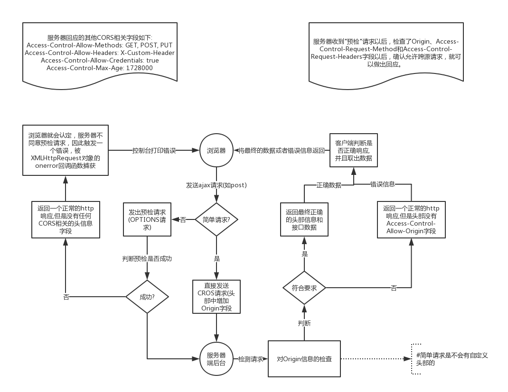

# 跨域

## 同源策略
当前端页面与后台运行在不同的服务器时，就必定会出现跨域这一问题。

【跨域问题出现在前端请求后端，而从未出现在后端请求后端。】

因为浏览器出于安全考虑，有同源策略。也就是说，如果协议、域名或者端口有一个不同就是跨域，Ajax 请求会失败。

同源策略SOP：指"协议+域名+端口"三者相同，如果缺少了同源策略，浏览器很容易受到XSS、CSFR等攻击。
```
1.Cookie、LocalStorage 和 IndexDB 无法读取
2.DOM 和 Js对象无法获得
3.AJAX 请求不能发送
```
* XSS(Cross-site scripting)跨站脚本攻击：通过客户端脚本语言（最常见如：JavaScript）在一个论坛发帖中发布一段恶意的JavaScript代码就是脚本注入，如果这个代码内容有请求外部服务器，那么就叫做XSS！
* CSRF(Cross-site request forgery)跨站请求伪造：又称XSRF，冒充用户发起请求（在用户不知情的情况下）,完成一些违背用户意愿的请求（如恶意发帖，删帖，改密码，发邮件等）

## 跨域解决方案
### 1、JSONP
JSONP 的原理：动态创建一个 script 标签，利用 script 标签的 src 属性不受同源策略限制，因为所有的 src 属性和 href 属性都不受同源策略的限制，可以请求第三方服务器资源内容。通过 <script> 标签指向一个需要访问的地址并提供一个回调函数来接收数据。
```js
<script src="http://domain/api?param1=a&param2=b&callback=jsonp"></script>
<script>
    function jsonp(data) {
    	console.log(data)
	}
</script>    
```
在开发中可能会遇到多个 JSONP 请求的回调函数名是相同的，这时候就需要自己封装一个 JSONP，以下是简单实现
```js
function jsonp(url, jsonpCallback, success) {
  let script = document.createElement("script");
  script.src = url;
  script.async = true;
  script.type = "text/javascript";
  window[jsonpCallback] = function(data) {
    success && success(data);
  };
  document.body.appendChild(script);
}
jsonp(
  "http://xxx",
  "callback",
  function(value) {
    console.log(value);
  }
);
```
* 优点：JSONP 使用简单且兼容性不错
* 缺点：但是只限于 get 请求

### 2、图像Ping
一个网页可以从任何网页加载图像，不用担心跨域不跨域，所以，我们就可以利用图片不受“同源限制”这一点进行跨域通信。

我们利用JS创建一个新的Image对象，并把src属性设置为指向请求的地址，通过监听onload和onerror事件来确定是否接受到了响应。响应的数据可以是任意内容，但通常是像素图或204响应。

需要注意的是，新图像元素只要设置了src属性就会开始下载，所以我们这里的事件一定要在指定src属性之前绑定，这也是为什么我们这里不需要把img标签插入DOM 的原因。
```
<body>
    <button id="Ping">图像Ping发送请求</button>
    <script>
        var btn=document.getElementById('Ping');
        btn.onclick=function () {
            var img=new Image();
            img.onload=img.onerror=function () {
                alert("Done");
            };
            img.src="http://localhost:8081/img?name=Joy";
        }
    </script>
</body>
```
缺点：

* 只能发送GET请求
* 无法访问服务器的响应文本

### 3、跨域资源共享（CORS）
浏览器会自动进行 CORS 通信，实现CORS通信的关键是后端。只要后端实现了 CORS，就实现了跨域。

服务端设置 Access-Control-Allow-Origin 就可以开启 CORS。 该属性表示哪些域名可以访问资源，如果设置通配符则表示所有网站都可以访问资源。普通跨域请求：只服务端设置Access-Control-Allow-Origin即可，前端无须设置，**若要带cookie请求：前后端都需要设置**。

思想：使用自定义的HTTP头部让浏览器与服务器进行沟通，从而决定请求或响应是应该成功还是应该失败

1. **过程**

发送请求附加一个额外的origin头部（包含请求页面的源信息【协议、域名、端口】） Origin:http：//nczonline.net

如果服务器认为这个请求可以接受，就在Access-Control-Allow-Origin头部发回相同的源信息（如果是公共资源，可以发回'*')
Access-Control-Allow-Origin:http：//nczonline.net

如果没有这个头部，或者有这个头部但源信息不匹配，浏览器就会驳回请求。正常情况下，浏览器会处理请求。注意，请求和响应都不包含cookie信息

2. **实现**

CORS分为简单请求和复杂请求，简单请求指的是：

（1）请求方法是以下三种方法之一：HEAD、GET、POST；

（2）HTTP的头信息不超出以下几种字段：
Accept、Accept-Language、Content-Language、Last-Event-ID、
Content-Type（只限于三个值application/x-www-form-urlencoded、multipart/form-data、text/plain）。

其他情况就是非简单请求了。

* **简单请求**：
（1）请求头：

```
Origin: http://www.domain.com
```

（2）响应头：

```
Access-Control-Allow-Origin: http://www.domain.com
Access-Control-Allow-Credentials: true   `是否允许传送cookie`
Access-Control-Expose-Headers: FooBar `CORS请求时，只能拿到6个基本字段：Cache-Control、Content-Language、Content-Type、Expires、Last-Modified、Pragma。如果想拿到其他字段，就必须指定。`
```

（3）另外，ajax请求中,如果要发送Cookie，Access-Control-Allow-Origin就不能设为星号，必须指定明确的、与请求网页一致的域名，还要设置以下内容：

```
var xhr = new XMLHttpRequest();
xhr.withCredentials = true;
```

* **预检请求（Prefllighted Request）**

简单请求（GET、HEAD、POST）不会触发预检请求

与前述简单请求不同，“需预检的请求”要求必须首先使用 OPTIONS 方法发起一个预检请求到服务器，以获知服务器是否允许该实际请求。"预检请求“的使用，可以避免跨域请求对服务器的用户数据产生未预期的影响。
```
使用了下面任一 HTTP 方法：
PUT
DELETE
CONNECT
OPTIONS
TRACE
PATCH
```

（1）预检请求:
```
OPTIONS /cors HTTP/1.1  `OPTIONS请求是用来询问的`
Origin: http://www.domian.com
Access-Control-Request-Method: PUT
Access-Control-Request-Headers: X-Custom-Header
```
（2）响应头：
```
Access-Control-Allow-Origin: http://www.domain.com
Access-Control-Allow-Methods: GET, POST, PUT  `服务器支持的所有跨域请求的方法`
Access-Control-Allow-Headers: X-Custom-Header  `服务器支持的所有头信息字段，不限于浏览器在"预检"中请求的字段。`
Access-Control-Allow-Credentials: true
Access-Control-Max-Age: 1728000  `指定本次预检请求的有效期，单位为秒`
```
（3）之后的步骤就同简单请求了。

3. **带凭据的请求**

1、 前端设置：
```
// 前端设置是否带cookie
xhr.withCredentials = true;
```
2、 服务端设置： 若后端设置成功，前端浏览器控制台则不会出现跨域报错信息，反之，说明没设成功。
```
// 允许前端带认证cookie：
启用此项后，上面的域名不能为'*'，必须指定具体的域名，否则浏览器会提示
response.setHeader("Access-Control-Allow-Credentials", "true"); 
```

4. **代码总结**

```js
// 前端
var xhr = new XMLHttpRequest(); // IE8/9需用window.XDomainRequest兼容

// 前端设置是否带cookie
xhr.withCredentials = true;

xhr.open('post', 'http://www.domain2.com:8080/login', true);
xhr.setRequestHeader('Content-Type', 'application/x-www-form-urlencoded');
xhr.send('user=admin');

xhr.onreadystatechange = function() {
    if (xhr.readyState == 4 && xhr.status == 200) {
        alert(xhr.responseText);
    }
};
```
```js
// 后端
var http = require('http');
var server = http.createServer();
var qs = require('querystring');

server.on('request', function(req, res) {
    var postData = '';

    // 数据块接收中
    req.addListener('data', function(chunk) {
        postData += chunk;
    });

    // 数据接收完毕
    req.addListener('end', function() {
        postData = qs.parse(postData);

        // 跨域后台设置
        res.writeHead(200, {
            'Access-Control-Allow-Credentials': 'true',     // 后端允许发送Cookie
            'Access-Control-Allow-Origin': 'http://www.domain1.com',    // 允许访问的域（协议+域名+端口）
            /* 
             * 此处设置的cookie还是domain2的而非domain1，因为后端也不能跨域写cookie(nginx反向代理可以实现)，
             * 但只要domain2中写入一次cookie认证，后面的跨域接口都能从domain2中获取cookie，从而实现所有的接口都能跨域访问
             */
            'Set-Cookie': 'l=a123456;Path=/;Domain=www.domain2.com;HttpOnly'  // HttpOnly的作用是让js无法读取cookie
        });

        res.write(JSON.stringify(postData));
        res.end();
    });
});

server.listen('8080');
console.log('Server is running at port 8080...');
```
使用node做代理！：创建一个代理服务器，在这个代理服务器中设置允许跨域

5. **与JSOP的比较**：

JSONP只支持GET请求，CORS支持所有类型的HTTP请求。JSONP的优势在于支持老式浏览器，以及可以向不支持CORS的网站请求数据。

6. **流程图**：



### 4、document.domain
该方式只能用于二级域名相同的情况下，比如 a.test.com 和 b.test.com 适用于该方式。

只需要给页面添加 document.domain = 'test.com' 表示二级域名都相同就可以实现跨域

1. **原理**：

两个页面都通过js强制设置document.domain为基础主域，就实现了同域。

2. **实现**：

（1）父窗口：(www.domain.com/a.html)
```
<iframe id="iframe" src="http://child.domain.com/b.html"></iframe>

<script>
    document.domain = 'domain.com';
    var user = 'admin';
</script>
```

（2）子窗口：(child.domain.com/b.html)
```
<script>
    document.domain = 'domain.com';
    // 获取父窗口中变量
    alert('get js data from parent ---> ' + window.parent.user);
</script>
```

### 5、h5 新特性 window.postMessage()
这种方式通常用于获取嵌入页面中的第三方页面数据。一个页面发送消息，另一个页面判断来源并接收消息
```js
// 发送消息端
window.parent.postMessage('message', 'http://test.com');
// 接收消息端
var mc = new MessageChannel();
mc.addEventListener('message', (event) => {
    var origin = event.origin || event.originalEvent.origin; 
    if (origin === 'http://test.com') {
        console.log('验证通过')
    }
});
```

> domain