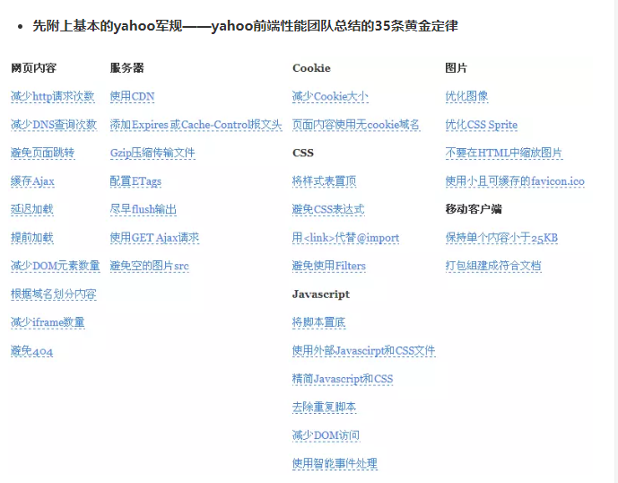
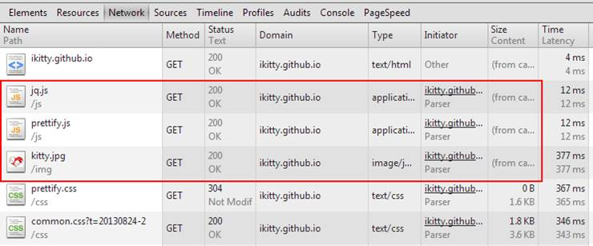

# 性能优化总结


## 网络

1. **减少请求的次数**：
* JS、CSS文件选择性合并
* 小图片合并雪碧图
* base64编码小图片放到CSS中
 
2. **减少文件大小**：
* 压缩CSS、JS、图片；
* 尽可能控制DOM节点数；
* 精简css、 JavaScript，移除注释、空格、重复css和脚本。
* 开启Gzip，Gzip的思想就是把文件先在服务器端进行压缩，且压缩率达到85%，然后再传输，传输完毕后浏览器会 重新对压缩过的内容进行解压缩，并执行。好处在于Gzip的支持已经很好，且爬虫可识别，压缩率达到66%-85%显著减少了文件传输的大小。另外，gzip对pdf文件的压缩效果不大，而且会浪费CPU。

3. **合理使用静态资源域名**：
域名的要求是短小且独立。

短小可以减少头部开销，因为域名越短请求头起始行的 URI 就越短。之所以要求独立，因为独立域名不会共享主域的 Cookie，可以有效减小请求头大小，这个策略一般称之为 Cookie-Free Domain；另外一个原因是浏览器对相同域名的并发连接数限制，一般允许同域名并发 6~8 个连接，域名不是越多越好，每个域名的第一个连接都要经历 DNS 查询（DNS Lookup），导致会耗费一定的时间，控制域名使用在2-4个之间。另外注意：同一静态资源在不同页面被散列到不同子域下，会导致无法利用 HTTP 缓存。

4. **使用HTTP 2**：
* 多路复用
* HEAD 压缩
* 请求优先级
* 服务器推送

## 服务端
1. **CDN**，将一个服务器的内容，平均分部到多个服务器上，服务器智能识别，让用户获取离用户最近的服务器，提高访问速度。
  
* 缺点:因为他是缓存文件,如果在网站更新了内容,部分电脑,可能不会实时的更新过来,它需要将CDN那台计算机的内容也更新了,客户的显示器上内容才是最新的,这个时间可能需要几小时,甚至半天.所以对于经常更新的网站,并不是很适合用CDN加速.
* 优点：读写分离，负载均衡，资源服务器与应用服务器的分离

2. **缓存**：静态资源缓存，移动端离线缓存。

缓存利用可包括：添加 Expires 头，配置 ETag，使 Ajax 可缓存等。其实，恰当的缓存设置可以大大的减少 HTTP请求，也可以节省带宽 。

* 配置 ETag：即客户端发送的If-None-Match: 上次 ETag 的内容。浏览器会发出请求询问服务端，资源是否过期；服务端发现,没有过期，直接返回一个状态码为 304、正文为空的响应，告知浏览器使用本地缓存；如果资源有更新，服务端返回状态码 200、Etag 和正文。这个过程被称之为 HTTP 的协商缓存，通常也叫做弱缓存。
* 添加 Expires 头：服务端通过响应头告诉浏览器，在什么时间之前（Expires）或在多长时间之内（Cache-Control: Max-age=xxx），不要再请求服务器了。这个机制我们通常称之为 HTTP 的强缓存。一般会对 CSS、JS、图片等资源使用强缓存，而入口文件（HTML）一般使用协商缓存或不缓存。
* AppCache：
AppCache主要利用manifest 文本文件，告知浏览器被缓存的内容以及不缓存的内容。



manifest 文件可分为三个部分：
1. CACHE MANIFEST - 在此标题下列出的文件将在首次下载后进行缓存，等价于CACHE
2. NETWORK - 在此标题下列出的文件需要与服务器的连接，且不会被缓存
3. FALLBACK - 在此标题下列出的文件规定当页面无法访问时的回退页面

使用AppCache方案的步骤：
1. 整理出需要缓存的静态文件列表，如juqery.js和gb.css。
2. 配置服务器支持。
3. 确定内容更新机制和浏览器兼容方案。

* LocalStorage：用于持久化的本地存储，除非主动删除数据，否则数据是永远不会过期的。

## 客户端
1. 因为JS引擎线程和GUI线程是互斥的，所以在脚本下载并执行完之前会阻塞页面渲染。所以需要将脚本放在结束标签之前。还有一种更好的方法是：在页面加载完成之后再加载JavaScript代码即无阻塞脚本：动态脚本元素、脚本注入
2. html的代码优化
* 避免空的图片src；
* 协议自适应，减少html文件大小，将https://和http://都替换成//。

3. css的代码优化
* 建议使用类选择器，访问比较快；
* 不建议使用很长的base64；
* 避免CSS表达式；
* 避免使用Filters。

4. js的代码优化
* 避免使用eval和width；
* 局部变量位于作用域链的起始位置，全局变量处于作用域链的末端。属性或方法在原型链中位置越深，访问速度越慢。所以可以通过把对象成员（原型链）、数组元素、跨域变量（作用域链）保存在局部变量改善性能，因为访问速度更快。
* 事件委托：利用事件逐级冒泡并能被父级元素捕捉，使用事件代理，给外层元素绑定事件处理器，就可以处理子元素上触发的所有事件。以此减少事件处理器的数量。
* 减少重绘和重排：当需要批量修改 DOM 时，可以通过元素 display 隐藏之后，操作拷贝，元素显示来减少重排次数，将 n 次重排变成一次重排。如设置类class统一更新样式，在添加多个li。
* 浏览器尝试通过队列化修改和批量执行的方式最小化重排次数，当我们查询布局信息时，会导致强制刷新队列。因此我们可以减少布局信息获取的次数，即第一次获取将其赋值给局部变量，再操作局部变量。
* 图片懒加载：利用scroll事件监听滚动事件，但是不断触发事件可能会降低性能。可以利用**函数节流和函数去抖**改善性能。图片预加载，提前加载重要内容。实现：img标签src属性为空，给一个data-xx属性，里面存放图片真实地址，当页面滚动直至此图片出现在可视区域时，用js取到该图片的data-xx的值赋给src。
* 让动画元素脱离文档流。比如absolute设置元素脱离文档流，让元素动起来，当它扩大时会临时覆盖部分页面，这只是页面的一个小区域的重绘，然后恢复定位就只会发生一次重排。


4. **预解析DNS**：过 DNS 预解析来告诉浏览器未来我们可能从某个特定的 URL 获取资源，当浏览器真正使用到该域中的某个资源时就可以尽快地完成 DNS 解析。
```
<link rel="dns-prefetch" href="//example.com">
```
另外需要注意的是，**浏览器会对a标签的href自动启用DNS Prefetching，所以a标签里包含的域名不需要在head中手动设置link。但是在HTTPS下不起作用，需要meta来强制开启功能**。这个限制的原因是防止窃听者根据DNS Prefetching推断显示在HTTPS页面中超链接的主机名。下面这句话作用是强制打开a标签域名解析
```
<meta http-equiv="x-dns-prefetch-control" content="on">
```
